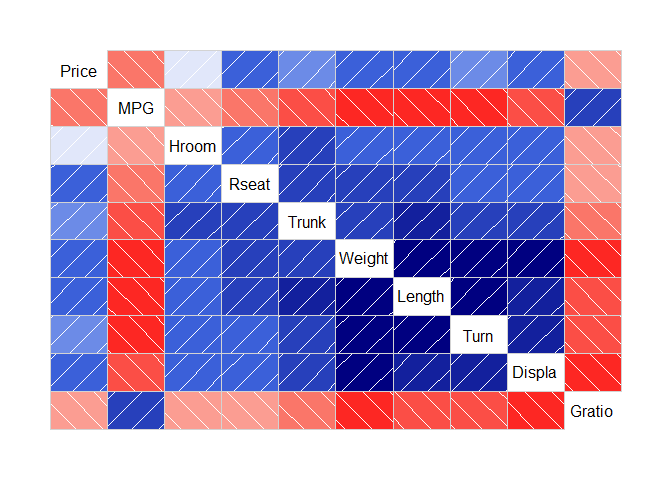
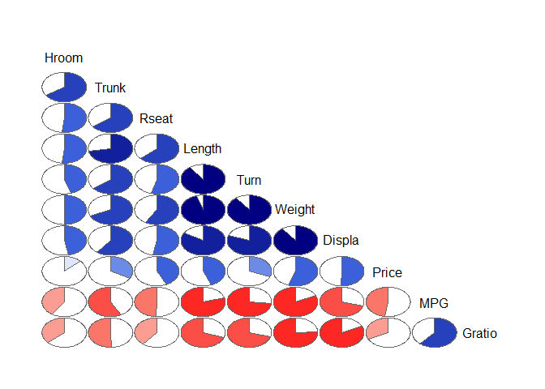
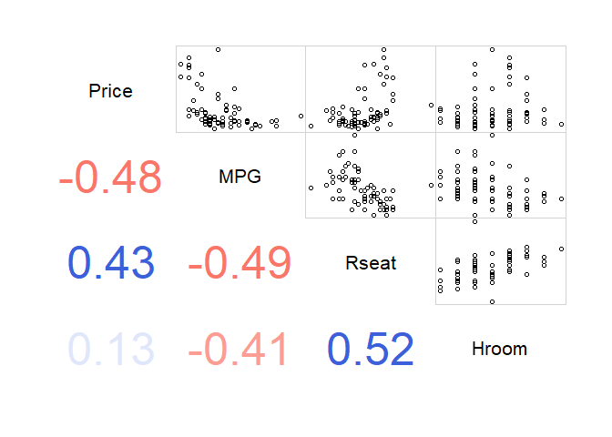

Correlation and Correlogram Exercises
================
Kostiantyn Kravchuk
8 April 2017


Correlation analysis is one of the most popular techniques for data
exploration. This set of exercises is intended to help you to extend,
speed up, and validate your correlation analysis. It allows to practice
in:

  - calculating linear and nonlinear correlation coefficients,  
  - testing those coefficients for statistical significance,  
  - creating correlation matrices to study interdependence between
    variables in dataframes,  
  - drawing graphical representations of those matrices
    (correlograms),  
  - calculating coefficients for partial correlation between two
    variables (controlling for their correlation with other variables).

The exercises make use of functions from the packages `Hmisc`,
`corrgram`, and `ggm`. Please install these packages, but do not load
them before starting the exercises in which they are needed (to avoid a
namespace conflict) (the `ggm` package contains the function called
`rcorr` which masks the `rcorr` function from the `Hmisc` package, and
vice versa. If you want to return to the `rcorr` function from the
`Hmisc` after loading the `ggm` package run `detach(package:ggm))`.  
Exercises are based on a reduced version of the auto dataset from the
`corrgram` package ([download
here](http://www.r-exercises.com/wp-content/uploads/2017/04/auto.csv)).
The dataset contains characteristics of 1979 automobile models. Answers
to the exercises are available
[here](http://www.r-exercises.com/2017/04/08/correlation-and-correlogram-exercises-solutions/).

## Exercise 1

Calculate simple (linear) correlation between car price and its fuel
economy (measured in miles per gallon, or `mpg`).

``` r
library(data.table)
df <- fread("http://www.r-exercises.com/wp-content/uploads/2017/04/auto.csv")
head(df)
```

    ##                Model Origin Price MPG Hroom Rseat Trunk Weight Length Turn
    ## 1: AMC Concord            A  4099  22   2.5  27.5    11   2930    186   40
    ## 2: AMC Pacer              A  4749  17   3.0  25.5    11   3350    173   40
    ## 3: AMC Spirit             A  3799  22   3.0  18.5    12   2640    168   35
    ## 4: Audi 5000              E  9690  17   3.0  27.0    15   2830    189   37
    ## 5: Audi Fox               E  6295  23   2.5  28.0    11   2070    174   36
    ## 6: BMW 320I               E  9735  25   2.5  26.0    12   2650    177   34
    ##    Displa Gratio
    ## 1:    121   3.58
    ## 2:    258   2.53
    ## 3:    121   3.08
    ## 4:    131   3.20
    ## 5:     97   3.70
    ## 6:    121   3.64

``` r
with(df, cor(Price, MPG))
```

    ## [1] -0.4757351

## Exercise 2

Use the `cor.test` function to check whether the obtained coefficient is
statistically significant at 5% level.

``` r
with(df, cor.test(Price, MPG))
```

    ## 
    ##  Pearson's product-moment correlation
    ## 
    ## data:  Price and MPG
    ## t = -4.5894, df = 72, p-value = 1.838e-05
    ## alternative hypothesis: true correlation is not equal to 0
    ## 95 percent confidence interval:
    ##  -0.6351861 -0.2773901
    ## sample estimates:
    ##        cor 
    ## -0.4757351

## Exercise 3

Simple correlation assumes a linear relationship between variables, but
it may be useful to relax this assumption. Calculate Spearman’s
correlation coefficient for the same variables, and find its statistical
significance.

``` r
with(df, cor.test(Price, MPG, method = "spearman"))
```

    ## Warning in cor.test.default(Price, MPG, method = "spearman"): Cannot
    ## compute exact p-value with ties

    ## 
    ##  Spearman's rank correlation rho
    ## 
    ## data:  Price and MPG
    ## S = 105440, p-value = 1.952e-07
    ## alternative hypothesis: true rho is not equal to 0
    ## sample estimates:
    ##       rho 
    ## -0.561438

## Exercise 4

In R, it is possible to calculate correlation for all pairs of numeric
variables in a dataframe at once. However, this requires excluding
non-numeric variables first. Create a new dataframe, `auto_num`, that
contains only columns with numeric values from the auto dataframe. You
can do this using the `Filter` function.

``` r
auto_num <- Filter(is.numeric, df)
head(auto_num)
```

    ##    Price MPG Hroom Rseat Trunk Weight Length Turn Displa Gratio
    ## 1:  4099  22   2.5  27.5    11   2930    186   40    121   3.58
    ## 2:  4749  17   3.0  25.5    11   3350    173   40    258   2.53
    ## 3:  3799  22   3.0  18.5    12   2640    168   35    121   3.08
    ## 4:  9690  17   3.0  27.0    15   2830    189   37    131   3.20
    ## 5:  6295  23   2.5  28.0    11   2070    174   36     97   3.70
    ## 6:  9735  25   2.5  26.0    12   2650    177   34    121   3.64

## Exercise 5

Use the `cor` function to create a matrix of correlation coefficients
for variables in the `auto_num`
    dataframe.

``` r
cor(auto_num)
```

    ##             Price        MPG      Hroom      Rseat      Trunk     Weight
    ## Price   1.0000000 -0.4757351  0.1278255  0.4299856  0.3269032  0.5514251
    ## MPG    -0.4757351  1.0000000 -0.4093789 -0.4944442 -0.5798478 -0.8228964
    ## Hroom   0.1278255 -0.4093789  1.0000000  0.5154697  0.6600985  0.4983723
    ## Rseat   0.4299856 -0.4944442  0.5154697  1.0000000  0.6419789  0.5869384
    ## Trunk   0.3269032 -0.5798478  0.6600985  0.6419789  1.0000000  0.6782135
    ## Weight  0.5514251 -0.8228964  0.4983723  0.5869384  0.6782135  1.0000000
    ## Length  0.4401617 -0.7963676  0.5139808  0.6271701  0.7241574  0.9551699
    ## Turn    0.3092515 -0.7342961  0.4505074  0.5418625  0.6390660  0.8976780
    ## Displa  0.5047089 -0.7056426  0.4672622  0.5277981  0.6056742  0.9006063
    ## Gratio -0.3263166  0.6137274 -0.3689797 -0.3980639 -0.5054895 -0.7567192
    ##            Length       Turn     Displa     Gratio
    ## Price   0.4401617  0.3092515  0.5047089 -0.3263166
    ## MPG    -0.7963676 -0.7342961 -0.7056426  0.6137274
    ## Hroom   0.5139808  0.4505074  0.4672622 -0.3689797
    ## Rseat   0.6271701  0.5418625  0.5277981 -0.3980639
    ## Trunk   0.7241574  0.6390660  0.6056742 -0.5054895
    ## Weight  0.9551699  0.8976780  0.9006063 -0.7567192
    ## Length  1.0000000  0.8998841  0.8379178 -0.6950146
    ## Turn    0.8998841  1.0000000  0.8023965 -0.7077485
    ## Displa  0.8379178  0.8023965  1.0000000 -0.8249820
    ## Gratio -0.6950146 -0.7077485 -0.8249820  1.0000000

## Exercise 6

The standard `cor.test` function does not work with dataframes. However,
statistical significance of correlation coefficients for a dataframe can
be verified using the `rcorr` function from the `Hmisc` package.  
Transform the `auto_num` dataframe into a matrix (`auto_mat`), and use
it to check significance of the correlation coefficients with the
`rcorr` function.

``` r
auto_mat <- as.matrix(auto_num)
Hmisc::rcorr(auto_mat)
```

    ##        Price   MPG Hroom Rseat Trunk Weight Length  Turn Displa Gratio
    ## Price   1.00 -0.48  0.13  0.43  0.33   0.55   0.44  0.31   0.50  -0.33
    ## MPG    -0.48  1.00 -0.41 -0.49 -0.58  -0.82  -0.80 -0.73  -0.71   0.61
    ## Hroom   0.13 -0.41  1.00  0.52  0.66   0.50   0.51  0.45   0.47  -0.37
    ## Rseat   0.43 -0.49  0.52  1.00  0.64   0.59   0.63  0.54   0.53  -0.40
    ## Trunk   0.33 -0.58  0.66  0.64  1.00   0.68   0.72  0.64   0.61  -0.51
    ## Weight  0.55 -0.82  0.50  0.59  0.68   1.00   0.96  0.90   0.90  -0.76
    ## Length  0.44 -0.80  0.51  0.63  0.72   0.96   1.00  0.90   0.84  -0.70
    ## Turn    0.31 -0.73  0.45  0.54  0.64   0.90   0.90  1.00   0.80  -0.71
    ## Displa  0.50 -0.71  0.47  0.53  0.61   0.90   0.84  0.80   1.00  -0.82
    ## Gratio -0.33  0.61 -0.37 -0.40 -0.51  -0.76  -0.70 -0.71  -0.82   1.00
    ## 
    ## n= 74 
    ## 
    ## 
    ## P
    ##        Price  MPG    Hroom  Rseat  Trunk  Weight Length Turn   Displa
    ## Price         0.0000 0.2778 0.0001 0.0045 0.0000 0.0000 0.0073 0.0000
    ## MPG    0.0000        0.0003 0.0000 0.0000 0.0000 0.0000 0.0000 0.0000
    ## Hroom  0.2778 0.0003        0.0000 0.0000 0.0000 0.0000 0.0000 0.0000
    ## Rseat  0.0001 0.0000 0.0000        0.0000 0.0000 0.0000 0.0000 0.0000
    ## Trunk  0.0045 0.0000 0.0000 0.0000        0.0000 0.0000 0.0000 0.0000
    ## Weight 0.0000 0.0000 0.0000 0.0000 0.0000        0.0000 0.0000 0.0000
    ## Length 0.0000 0.0000 0.0000 0.0000 0.0000 0.0000        0.0000 0.0000
    ## Turn   0.0073 0.0000 0.0000 0.0000 0.0000 0.0000 0.0000        0.0000
    ## Displa 0.0000 0.0000 0.0000 0.0000 0.0000 0.0000 0.0000 0.0000       
    ## Gratio 0.0045 0.0000 0.0012 0.0004 0.0000 0.0000 0.0000 0.0000 0.0000
    ##        Gratio
    ## Price  0.0045
    ## MPG    0.0000
    ## Hroom  0.0012
    ## Rseat  0.0004
    ## Trunk  0.0000
    ## Weight 0.0000
    ## Length 0.0000
    ## Turn   0.0000
    ## Displa 0.0000
    ## Gratio

## Exercise 7

Use the `corrgram` function from the `corrgram` package to create a
default correlogram to visualize correlations between variables in the
`auto` dataframe.

``` r
library(corrgram)
corrgram(df)
```

<!-- -->

## Exercise 8

Create another correlogram that (1) includes only the lower panel, (2)
uses pie diagrams to represent correlation coefficients, and (3) orders
the variables using the default
order.

``` r
corrgram(df, lower.panel = panel.pie, upper.panel = NULL, order = TRUE)
```

<!-- -->

## Exercise 9

Create a new dataframe, `auto_subset`, by subsetting the `auto`
dataframe to include only the `Price`, `MPG`, `Hroom`, and `Rseat`
variables. Use the new dataframe to create a correlogram that (1) shows
correlation coefficients on the lower panel, and (2) shows scatter plots
(points) on the upper panel.

``` r
auto_subset <- df[, c('Price', 'MPG', 'Rseat', 'Hroom')]
corrgram(auto_subset, lower.panel = panel.cor, upper.panel = panel.pts)
```

<!-- -->

## Exercise 10

Use the the correlations function from the `ggm` package to create a
correlation matrix with both full and partial correlation coefficients
for the `auto_subset` dataframe. Find the partial correlation between
car price and its fuel economy.

``` r
library(ggm)
correlations(auto_subset)
```

    ##            Price        MPG      Rseat      Hroom
    ## Price  1.0000000 -0.3712152  0.3141859 -0.2070536
    ## MPG   -0.4757351  1.0000000 -0.2029395 -0.2653050
    ## Rseat  0.4299856 -0.4944442  1.0000000  0.4316971
    ## Hroom  0.1278255 -0.4093789  0.5154697  1.0000000

``` r
correlations(auto_subset)["Price", "MPG"]
```

    ## [1] -0.3712152
