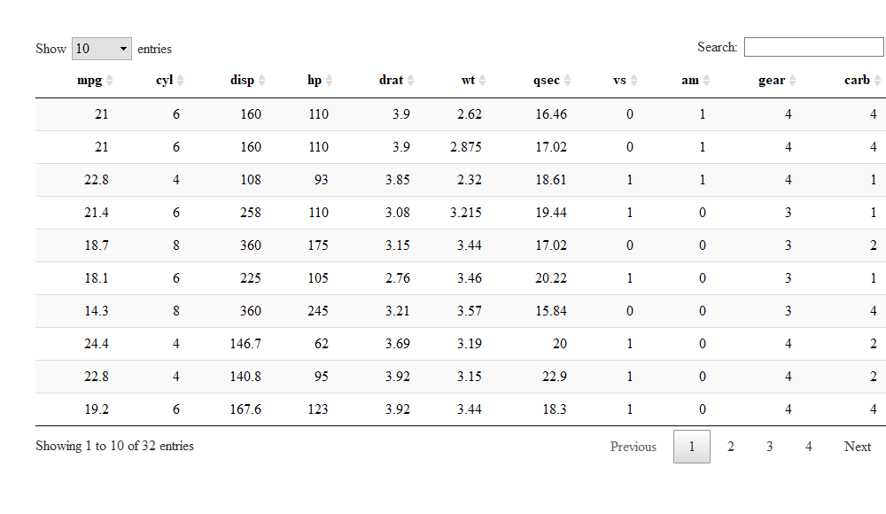

Creating interactive data tables: Exercises
================
Euthymios Kasvikis
30 November 2017


The package DT offers an R “window” to JavaScript DataTables. R uses
data in matrices’ or data frames’ form; with DT, they can be displayed
as tables on HTML pages. The important thing is that filtering,
pagination, sorting, etc. are used to transform it into a really useful
tool.

Before proceeding, please follow our short
[tutorial](http://r-exercises.com/2017/11/23/how-to-create-interactive-data-tables-with-dt/).

Look at the examples given and try to understand the logic behind them.
Then try to solve the exercises below using R, without looking at the
answers. Then check the
[solutions](http://r-exercises.com/2017/11/30/dt-exercises-solutions/).
to check your answers.

## Exercise 1

Create a basic data table of the `iris` dataset.

> HINT: Use datatable().

``` r
library(data.table)
library(DT)
datatable(iris)
```

<!-- -->

## Exercise 2

Create a basic data table of the `iris` dataset and set the class to
“cell-border stripe”.

> HINT: Use
class.

``` r
datatable(iris, class = "cell-border stripe")
```

<!-- -->

## Exercise 3

Create a basic data table of the `mtcars` dataset with the row names
displayed.

``` r
datatable(mtcars, rownames = TRUE)
```

<!-- -->

## Exercise 4

Create a basic data table of the mtcars dataset without row names.

> HINT: Use rownames =
FALSE

``` r
datatable(mtcars, rownames = FALSE)
```

<!-- -->

## Exercise 5

Create a basic data table of the first 6 rows of `mtcars` dataset, but
replace row names with the first 6 alphabet letters.

> HINT: Use rownames =
head(LETTERS)

``` r
datatable(head(mtcars, 6), rownames = head(LETTERS, 6))
```

<!-- -->

## Exercise 6

Create a basic data table of the `iris` dataset, but replace the column
names with names of your choice.

> HINT: Use
colnames

``` r
datatable(iris, colnames = c('One', 'Two', 'Three', 'Four', 'Five'))
```

<!-- -->

## Exercise 7

Create a basic data table of the `iris` dataset, but replace the `Petal.
Width` column name with
`PW`.

``` r
datatable(iris, colnames = c('PW' = 'Petal.Width'))
```

<!-- -->

## Exercise 8

Create a basic data table of the `iris` dataset, but change the first
column name to
`ID`.

``` r
datatable(iris, colnames = c('ID' = 1))
```

<!-- -->

## Exercise 9

Create a basic data table of the `iris` dataset and add a `caption` of
your choice.

> HINT: Use
`caption`

``` r
datatable(iris, caption = 'Caption')
```

<!-- -->

## Exercise 10

Create a basic data table of the `iris` dataset, but add filters in
every column
top.

``` r
datatable(iris, filter = 'top')
```

<!-- -->
