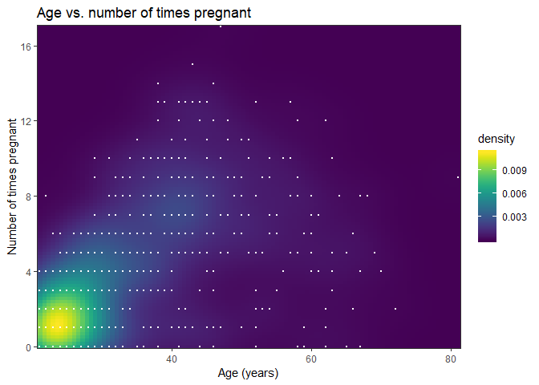

Data science for Doctors: Variable importance Exercises
================
Vasileios Tsakalos
28 April 2017


Data science enhances people’s decision making. Doctors and researchers
are making critical decisions every day. Therefore, it is absolutely
necessary for those people to have some basic knowledge of data science.
This series aims to help people that are around medical field to enhance
their data science skills.

We will work with a health related database the famous “Pima Indians
Diabetes Database”. It was generously donated by Vincent Sigillito from
Johns Hopkins University. Please find further information regarding the
dataset
[here](https://archive.ics.uci.edu/ml/machine-learning-databases/pima-indians-diabetes/pima-indians-diabetes.names).

This is the tenth part of the series and it aims to cover the very
basics of the subject of principal correlation coefficient and
components analysis, those two methods illustrate how variables are
related. In my opinion, it is necessary for researchers to know how to
have a notion of the relationships between variables, in order to be
able to find potential cause and effect relation – however this relation
is hypothetical, you can’t claim that there is a cause-effect relation
only because the correlation is high between those two variables-,remove
unecessary variables etc. In particular we will go through [Pearson
correlation
coefficient](https://en.wikipedia.org/wiki/Pearson_correlation_coefficient)
and [Confidence
interval](https://en.wikipedia.org/wiki/Bootstrapping_\(statistics\)) by
the bootstrap and [Principal component
analysis](https://en.wikipedia.org/wiki/Principal_component_analysis).

Before proceeding, it might be helpful to look over the help pages for
the `ggplot`, `cor`, `cor.tes`, `boot.cor`, `quantile`, `eigen`,
`princomp`, `summary`, `plot`, `autoplot`.

Moreover please load the following libraries.

    install.packages("ggplot2")
    library(ggplot2)
    install.packages("ggfortify")
    library(ggfortify)

Please run the code below in order to load the data set and transform it
into a proper data frame
    format:

    url <- "https://archive.ics.uci.edu/ml/machine-learning-databases/pima-indians-diabetes/pima-indians-diabetes.data"
    data <- read.table(url, fileEncoding="UTF-8", sep=",")
    names <- c('preg', 'plas', 'pres', 'skin', 'test', 'mass', 'pedi', 'age', 'class')
    colnames(data) <- names
    data <- data[-which(data$mass == 0),]

Answers to the exercises are available
[here](http://www.r-exercises.com/2017/04/28/data-science-for-doctors-variable-importance-solutions).

If you obtained a different (correct) answer than those listed on the
solutions page, please feel free to post your answer as a comment on
that page.

## Exercise 1

Compute the value of the correlation coefficient for the variables `age`
and `preg`.

``` r
library(ggplot2)
library(ggfortify)
url <- "https://gist.githubusercontent.com/chaityacshah/899a95deaf8b1930003ae93944fd17d7/raw/3d35de839da708595a444187e9f13237b51a2cbe/pima-indians-diabetes.csv"
data <- read.table(url, fileEncoding = "UTF-8", sep = ",", header = TRUE)
colnames(data)
```

    ## [1] "X1..Number.of.times.pregnant"                                                
    ## [2] "X2..Plasma.glucose.concentration.a.2.hours.in.an.oral.glucose.tolerance.test"
    ## [3] "X3..Diastolic.blood.pressure..mm.Hg."                                        
    ## [4] "X4..Triceps.skin.fold.thickness..mm."                                        
    ## [5] "X5..2.Hour.serum.insulin..mu.U.ml."                                          
    ## [6] "X6..Body.mass.index..weight.in.kg..height.in.m..2."                          
    ## [7] "X7..Diabetes.pedigree.function"                                              
    ## [8] "X8..Age..years."                                                             
    ## [9] "X9..Class.variable..0.or.1."

``` r
names <- c('preg', 'plas', 'pres', 'skin', 'test', 'mass', 'pedi', 'age', 'class')
colnames(data) <- names
data <- data[- which(data$mass == 0), ]
head(data)
```

    ##   preg plas pres skin test mass  pedi age class
    ## 1    6  148   72   35    0 33.6 0.627  50     1
    ## 2    1   85   66   29    0 26.6 0.351  31     0
    ## 3    8  183   64    0    0 23.3 0.672  32     1
    ## 4    1   89   66   23   94 28.1 0.167  21     0
    ## 5    0  137   40   35  168 43.1 2.288  33     1
    ## 6    5  116   74    0    0 25.6 0.201  30     0

``` r
with(data = data, cor(age, preg))
```

    ## [1] 0.5470464

## Exercise 2

Construct the scatterplot for the variables `age` and `preg`.

``` r
library(viridis)
ggplot(data = data, aes(x = age, y = preg)) +
  stat_density2d(geom = "raster", aes(fill = stat(density)), contour = FALSE) +
  scale_fill_viridis() +
  coord_cartesian(expand = FALSE) +
  geom_point(col = 'white', size = .3) +
  labs(x = "Age (years)", y = "Number of times pregnant", 
       title = "Age vs. number of times pregnant") +
  theme_bw()
```

<!-- -->

## Exercise 3

Apply a correlation test for the variables `age` and `preg` with null
hypothesis to be the correlation is zero and the alternative to be
different from zero.

> Hint: `cor.test`

``` r
with(data, cor.test(age, preg))
```

    ## 
    ##  Pearson's product-moment correlation
    ## 
    ## data:  age and preg
    ## t = 17.956, df = 755, p-value < 2.2e-16
    ## alternative hypothesis: true correlation is not equal to 0
    ## 95 percent confidence interval:
    ##  0.4950886 0.5951054
    ## sample estimates:
    ##       cor 
    ## 0.5470464

## Exercise 4

Construct a 95% confidence interval is by the bootstrap. First find the
correlation by bootstrap.

> Hint: `mean`

``` r
data_mat <- data.frame(data$age, data$preg)
boot.cor <- rep(0, 1000)
for(i in 1:1000) {
  temp_dat <- data_mat[sample(1:nrow(data_mat), replace=TRUE), ]
  boot.cor[i] <- cor(temp_dat$data.age, temp_dat$data.preg)
}
mean(boot.cor)
```

\[1\] 0.5452599

## Exercise 5

Now that you have found the correlation, find the 95% confidence
interval.

``` r
quantile(boot.cor, c(0.025,0.975))
```

    ##      2.5%     97.5% 
    ## 0.4899658 0.5948361

## Exercise 6

Find the eigen values and eigen vectors for the data set(exclude the
`class.fac` variable).

``` r
eigen(cor(data[, 1:ncol(data) - 1]))
```

    ## $values
    ## [1] 2.0304607 1.7385516 1.0149921 0.8824292 0.7579887 0.7498452 0.4237480
    ## [8] 0.4019845
    ## 
    ## $vectors
    ##            [,1]       [,2]        [,3]        [,4]       [,5]         [,6]
    ## [1,] -0.1347138 -0.5927916 -0.03827470  0.11603564  0.4404822 -0.203445264
    ## [2,] -0.4032769 -0.1745432  0.47123900 -0.41846209 -0.4465982 -0.056159271
    ## [3,] -0.3150487 -0.2094878 -0.57339434 -0.02405326 -0.3253132  0.629218769
    ## [4,] -0.4472775  0.3240528 -0.30160998  0.04995874  0.4518136 -0.043745459
    ## [5,] -0.4514210  0.2425520  0.28245059 -0.36856349  0.3937729  0.226343367
    ## [6,] -0.4441858  0.1078598 -0.30035688  0.13626781 -0.3380197 -0.670119333
    ## [7,] -0.2862606  0.1156969  0.42511104  0.80555733 -0.1068986  0.239296185
    ## [8,] -0.1920418 -0.6207950  0.07750626  0.07085332  0.1257758 -0.008504805
    ##             [,7]         [,8]
    ## [1,] -0.60445636  0.121404625
    ## [2,] -0.06519814  0.450412189
    ## [3,] -0.15189582 -0.051790878
    ## [4,]  0.26872922  0.568509976
    ## [5,] -0.12510923 -0.547566831
    ## [6,] -0.05090037 -0.341136200
    ## [7,] -0.07947780  0.004516529
    ## [8,]  0.71451668 -0.200699150

## Exercise 7

Compute the principal components for the dataset used
above.

``` r
pca <- princomp(data[, 1:ncol(data) - 1], center = TRUE, cor = TRUE, scores = TRUE)
pca
```

    ## Call:
    ## princomp(x = data[, 1:ncol(data) - 1], cor = TRUE, scores = TRUE, 
    ##     center = TRUE)
    ## 
    ## Standard deviations:
    ##    Comp.1    Comp.2    Comp.3    Comp.4    Comp.5    Comp.6    Comp.7 
    ## 1.4249424 1.3185415 1.0074682 0.9393770 0.8706255 0.8659360 0.6509593 
    ##    Comp.8 
    ## 0.6340225 
    ## 
    ##  8  variables and  757 observations.

## Exercise 8

Show the importance of each principal component.

``` r
smr <- summary(pca)
smr
```

    ## Importance of components:
    ##                           Comp.1    Comp.2    Comp.3    Comp.4     Comp.5
    ## Standard deviation     1.4249424 1.3185415 1.0074682 0.9393770 0.87062545
    ## Proportion of Variance 0.2538076 0.2173189 0.1268740 0.1103036 0.09474858
    ## Cumulative Proportion  0.2538076 0.4711265 0.5980005 0.7083042 0.80305278
    ##                            Comp.6     Comp.7     Comp.8
    ## Standard deviation     0.86593603 0.65095933 0.63402251
    ## Proportion of Variance 0.09373065 0.05296851 0.05024807
    ## Cumulative Proportion  0.89678343 0.94975193 1.00000000

## Exercise 9

Plot the principal components using an elbow graph.

``` r
qplot(x = names(smr$sdev), 
      y = smr$sdev, 
      xlab = "Components",
      ylab = "Standard deviation",
      main = "Elbow Graph of PCA",
      geom = c("path", "point"), 
      group = 1) +
  theme_bw()
```

<!-- -->

## Exercise 10

Constract a scatterplot with x-axis to be the first component and the
y-axis to be the second component. Moreover if possible draw the eigen
vectors on the plot. \> Hint: autoplot

``` r
autoplot(pca, colour = "age",
         loadings = TRUE,
         loadings.label = TRUE,
         loadings.label.size = 5) +
  theme_bw()
```

<!-- -->
