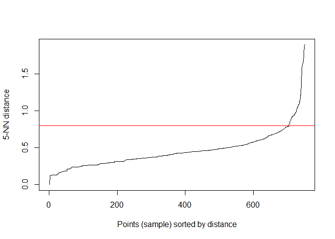
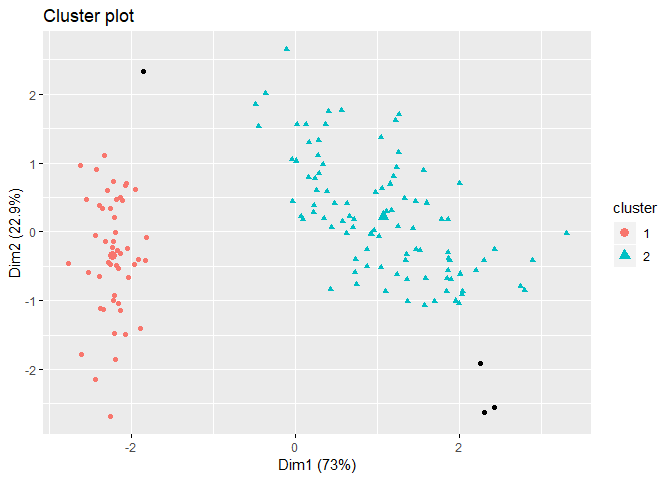
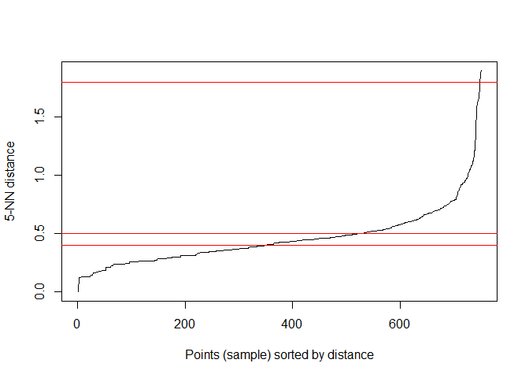
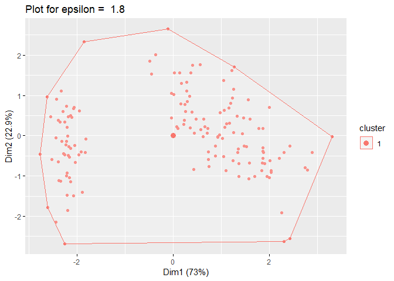
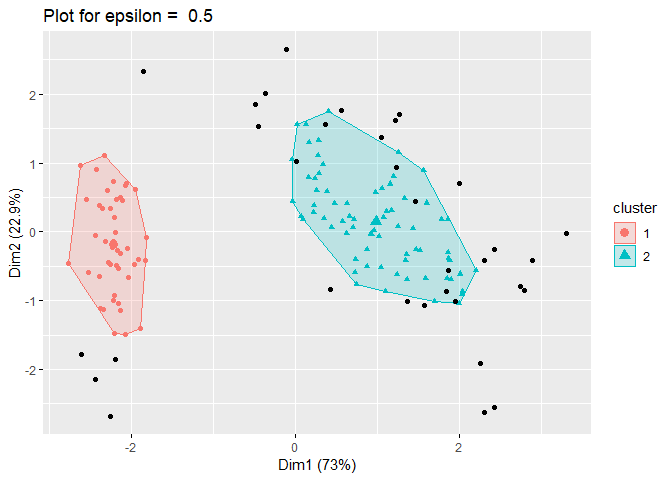
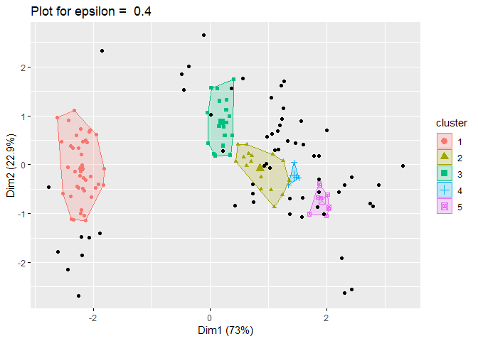
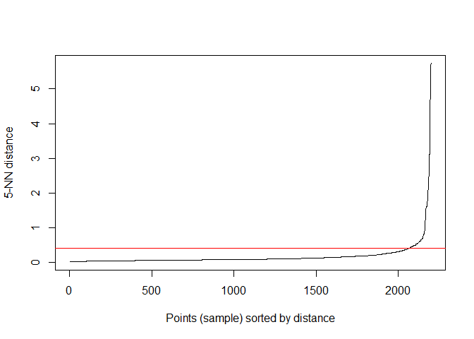
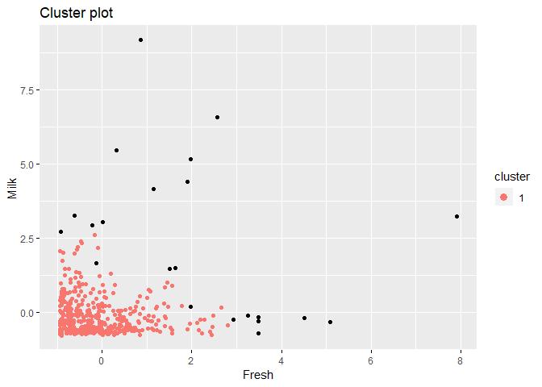
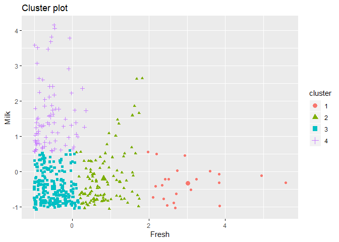
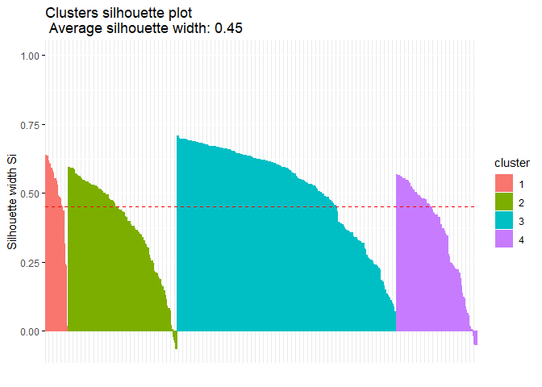

Density-Based Clustering Exercises
================
Kostiantyn Kravchuk
10 June 2017


Density-based clustering is a technique that allows to partition data
into groups with similar characteristics (clusters) but does not require
specifying the number of those groups in advance. In density-based
clustering, clusters are defined as dense regions of data points
separated by low-density regions. Density is measured by the number of
data points within some radius.

Advantages of density-based clustering:

  - as mentioned above, it does not require a predefined number of
    clusters,
  - clusters can be of any shape, including non-spherical ones,
  - the technique is able to identify noise data (outliers).

Disadvantages:

  - density-based clustering fails if there are no density drops between
    clusters,
  - it is also sensitive to parameters that define density (radius and
    the minimum number of points); proper parameter setting may require
    domain knowledge.

There are different methods of density-based clustering. The most
popular are DBSCAN (density-based spatial clustering of applications
with noise), which assumes constant density of clusters, OPTICS
(ordering points to identify the clustering structure), which allows for
varying density, and “mean-shift”.  
This set of exercises covers basic techniques for using the DBSCAN
method, and allows to compare its result to the results of the k-means
clustering algorithm by means of the silhouette analysis.  
The set requires the packages dbscan, cluster, and factoextra to be
installed. The exercises make use of the iris data set, which is
supplied with R, and the wholesale customers data set from the
University of California, Irvine (UCI) machine learning repository
([download
here](http://www.r-exercises.com/wp-content/uploads/2017/06/Wholesale-customers-data.csv)).  
Answers to the exercises are available
[here](http://r-exercises.com/2017/06/10/density-based-clustering-exercises-solutions/).

## Exercise 1

Create a new data frame using all but the last variable from the `iris`
data set, which is supplied with R.

``` r
df <- iris[, -ncol(iris)]
head(df)
```

    ##   Sepal.Length Sepal.Width Petal.Length Petal.Width
    ## 1          5.1         3.5          1.4         0.2
    ## 2          4.9         3.0          1.4         0.2
    ## 3          4.7         3.2          1.3         0.2
    ## 4          4.6         3.1          1.5         0.2
    ## 5          5.0         3.6          1.4         0.2
    ## 6          5.4         3.9          1.7         0.4

## Exercise 2

Use the `scale`function to normalize values of all variables in the new
data set (with default settings). Ensure that the resulting object is of
class `data.frame`.

``` r
df <- data.frame(scale(df))
head(df)
```

    ##   Sepal.Length Sepal.Width Petal.Length Petal.Width
    ## 1   -0.8976739  1.01560199    -1.335752   -1.311052
    ## 2   -1.1392005 -0.13153881    -1.335752   -1.311052
    ## 3   -1.3807271  0.32731751    -1.392399   -1.311052
    ## 4   -1.5014904  0.09788935    -1.279104   -1.311052
    ## 5   -1.0184372  1.24503015    -1.335752   -1.311052
    ## 6   -0.5353840  1.93331463    -1.165809   -1.048667

## Exercise 3

Plot the distribution of distances between data points and their fifth
nearest neighbors using the `kNNdistplot` function from the `dbscan`
package.  
Examine the plot and find a tentative threshold at which distances start
increasing quickly. On the same plot, draw a horizontal line at the
level of the threshold.

``` r
library(dbscan)
kNNdistplot(df, k = 5)
abline(h = 0.8, col = "red")
```

<!-- -->

## Exercise 4

Use the `dbscan` function from the package of the same name to find
density-based clusters in the data. Set the size of the epsilon
neighborhood at the level of the found threshold, and set the number of
minimum points in the epsilon region equal to 5.  
Assign the value returned by the function to an object, and print that
object.

``` r
db_clusters_iris <- dbscan(x = df, eps = .8, minPts = 5)
db_clusters_iris
```

    ## DBSCAN clustering for 150 objects.
    ## Parameters: eps = 0.8, minPts = 5
    ## The clustering contains 2 cluster(s) and 4 noise points.
    ## 
    ##  0  1  2 
    ##  4 49 97 
    ## 
    ## Available fields: cluster, eps, minPts

## Exercise 5

Plot the clusters with the `fviz_cluster` function from the `factoextra`
package. Choose the geometry type to draw only points on the graph, and
assign the `ellipse` parameter value such that an outline around points
of each cluster is not drawn.

> (Note that the `fviz_cluster` function produces a 2-dimensional plot.
> If the data set contains two variables those variables are used for
> plotting, if the number of variables is bigger the first two principal
> components are drawn.)

``` r
library(factoextra)
fviz_cluster(object = db_clusters_iris, data = df, ellipse = FALSE, geom = "point")
```

<!-- -->

## Exercise 6

Examine the structure of the cluster object obtained in Exercise 4, and
find the vector with cluster assignments. Make a copy of the data set,
add the vector of cluster assignments to the data set, and print its
first few lines.

``` r
df_copy <- df
df_copy[['cluster']] <- db_clusters_iris[['cluster']]
print(head(df_copy))
```

    ##   Sepal.Length Sepal.Width Petal.Length Petal.Width cluster
    ## 1   -0.8976739  1.01560199    -1.335752   -1.311052       1
    ## 2   -1.1392005 -0.13153881    -1.335752   -1.311052       1
    ## 3   -1.3807271  0.32731751    -1.392399   -1.311052       1
    ## 4   -1.5014904  0.09788935    -1.279104   -1.311052       1
    ## 5   -1.0184372  1.24503015    -1.335752   -1.311052       1
    ## 6   -0.5353840  1.93331463    -1.165809   -1.048667       1

## Exercise 7

Now look at what happens if you change the epsilon value.

1.  Plot again the distribution of distances between data points and
    their fifth nearest neighbors (with the `kNNdistplot` function, as
    in Exercise 3). On that plot, draw horizontal lines at levels 1.8,
    0.5, and 0.4.  
2.  Use the `dbscan` function to find clusters in the data with the
    epsilon set at these values (as in Exercise 4).  
3.  Plot the results (as in the Exercise 5, but now set the `ellipse`
    parameter value such that an outline around points is drawn).

<!-- end list -->

``` r
# create a vector of epsilon values
epsilon_values <- c(1.8, 0.5, 0.4)

# plot the distribution of distances
kNNdistplot(df, k = 5)

# plot lines at epsilon values
for (e in epsilon_values) {
  abline(h = e, col = "red")
}
```

<!-- -->

``` r
# find clusters for each epsilon value and plot those clusters
for (e in epsilon_values) {
  db_clusters_iris <- dbscan(df, eps=e, minPts=4)
  title <- paste("Plot for epsilon = ", e)
  g <- fviz_cluster(db_clusters_iris, df, ellipse = TRUE, geom = "point",
                    main = title)
  print(g)
}
```

<!-- --><!-- --><!-- -->

## Exercise 8

This exercise shows how the DBSCAN algorithm can be used as a way to
detect outliers:

1.  Load the `Wholesale` customers data set, and delete all variables
    with the exception of `Fresh` and `Milk`. Assign the data set to the
    `customers` variable.  
2.  Discover clusters using the steps from Exercises 2-5: scale the
    data, choose an epsilon value, find clusters, and plot them. Set the
    number of minimum points to 5. Use the `db_clusters_customers`
    variable to store the output of the `dbscan`
function.

<!-- end list -->

``` r
customers <- read.csv("http://www.r-exercises.com/wp-content/uploads/2017/06/Wholesale-customers-data.csv")
customers <- customers[, c("Fresh", "Milk")]

scale_customers <- data.frame(scale(customers))
kNNdistplot(scale_customers, k = 5)
abline(h = 0.4, col = "red")
```

<!-- -->

``` r
db_clusters_customers <- dbscan(scale_customers, eps = 0.4, minPts = 5)
db_clusters_customers
```

    ## DBSCAN clustering for 440 objects.
    ## Parameters: eps = 0.4, minPts = 5
    ## The clustering contains 1 cluster(s) and 22 noise points.
    ## 
    ##   0   1 
    ##  22 418 
    ## 
    ## Available fields: cluster, eps, minPts

``` r
fviz_cluster(db_clusters_customers, scale_customers, ellipse = FALSE, geom = "point")
```

<!-- -->

## Exercise 9

Compare the results obtained in the previous exercise with the results
of the k-means algorithm. First, find clusters using this algorithm:

1.  Use the same data set, but get rid of outliers for both variables
    (here the outliers may be defined as values beyond 2.5 standard
    deviations from the mean; note that the values are already expressed
    in unit of standard deviation about the mean). Assign the new data
    set to the `customers_core` variable.
2.  Use `kmeans` function to obtain an object with cluster assignments.
    Set the number of centers equal to 4, and the number of initial
    random sets (the nstart parameter) equal to 10. Assign the obtained
    object to the variable `km_clusters_customers` variable.
3.  Plot clusters using the `fviz_cluster` function (as in the previous
    exercise).

<!-- end list -->

``` r
# remove values beyond 2.5 standard deviations 
customers_core <- scale_customers[scale_customers[['Fresh']] > -2.5 &
                              scale_customers[['Fresh']] < 2.5, ]
customers_core <- scale_customers[scale_customers[['Milk']] > -2.5 &
                                   scale_customers[['Milk']] < 2.5, ]

# find clusters and plot them
km_clusters_customers <- kmeans(customers_core, centers = 4, nstart = 10)
fviz_cluster(km_clusters_customers,
             customers_core,
             ellipse = FALSE,
             geom = "point")
```

<!-- -->

## Exercise 10

Now compare the results of DBSCAN and k-means using silhouette analysis:

1.  Retrieve a vector of cluster assignments from the
    `db_clusters_customers` object.
2.  Calculate distances between data points in the `customers` data set
    using the `dist` function (with the default parameters).
3.  Use the vector and the distances object as inputs into the
    `silhouette` function from the `cluster` package to get a silhouette
    information object.
4.  Plot that object with the `fviz_silhouette` function from the
    `factoextra` package.
5.  Repeat the steps described above for the `km_clusters_customers`
    object and the `customers_core` data sets.
6.  Compare two plots and the average silhouette width values.

<!-- end list -->

``` r
library(cluster)
## DBSCAN results
# retrieve a vector of cluster assignments
db_clusters_vector <- db_clusters_customers[['cluster']]

# calculate distances between data points
db_distances <- dist(customers)

# get a silhouette information object
db_silhouette <- silhouette(db_clusters_vector, db_distances)

# plot the silhouette
fviz_silhouette(db_silhouette)
```

    ##   cluster size ave.sil.width
    ## 0       0   22           0.0
    ## 1       1  418           0.7

<!-- -->

``` r
## k-means results
# retrieve a vector of cluster assignments
km_clusters_vector <- km_clusters_customers[['cluster']]

# calculate distances between data points
km_distances <- dist(customers_core)
# get a silhouette information object
km_silhouette <- silhouette(km_clusters_vector, km_distances)

# plot the silhouette
fviz_silhouette(km_silhouette)
```

    ##   cluster size ave.sil.width
    ## 1       1   22          0.48
    ## 2       2  108          0.38
    ## 3       3  218          0.52
    ## 4       4   80          0.35

<!-- -->
