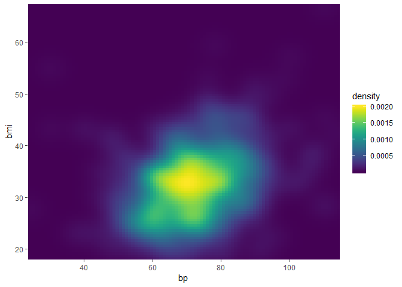
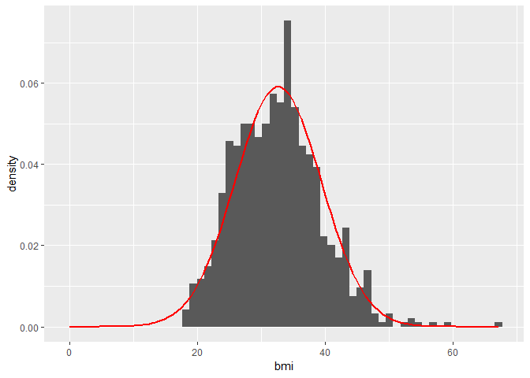
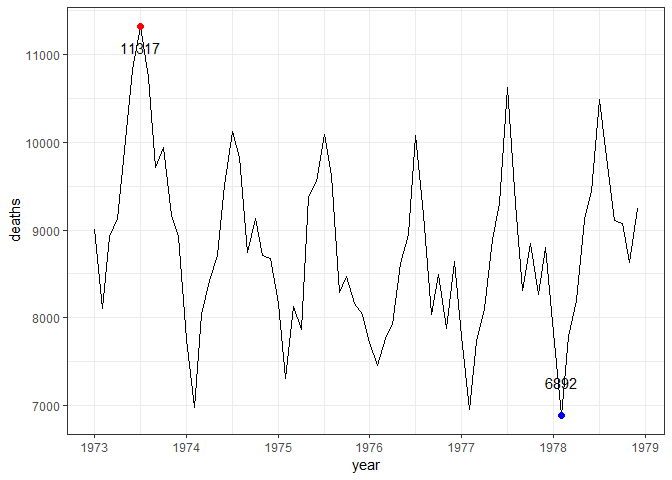
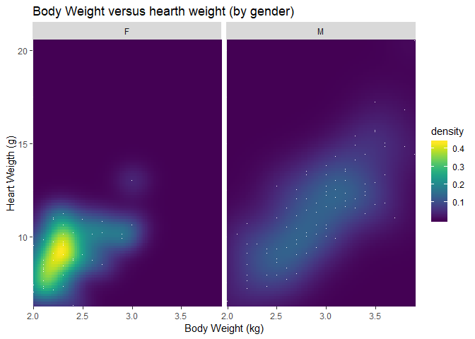
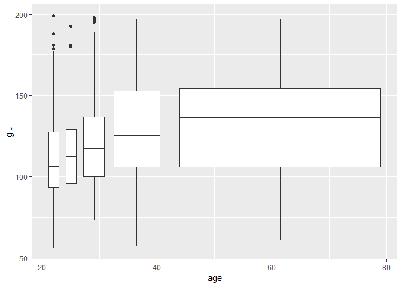
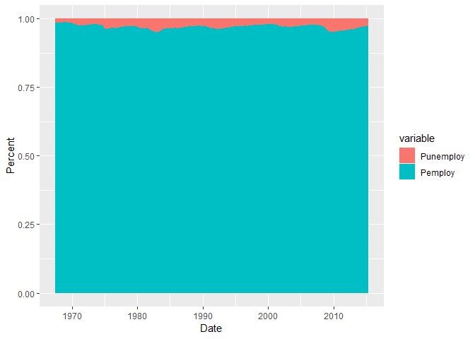
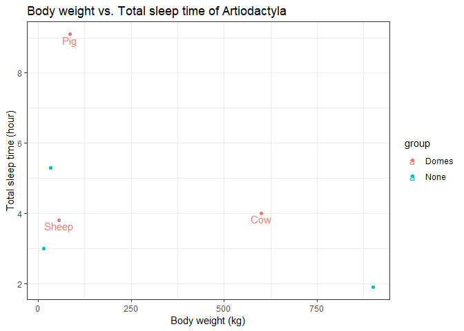
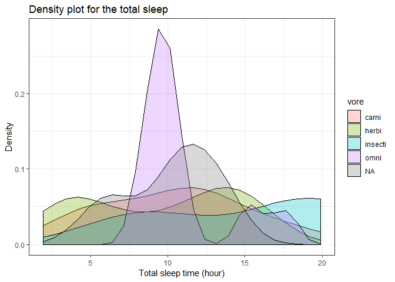
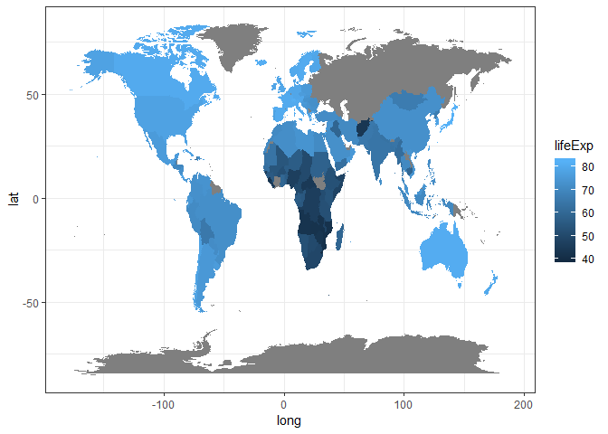
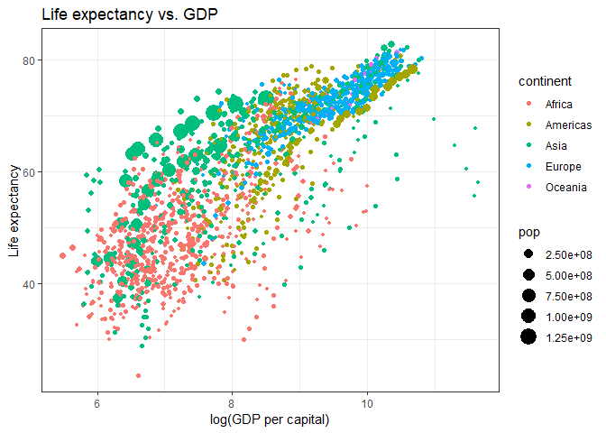

GGplot Drilling: Exercises
================
sindri
8 February 2018


Visualization is a key component to understanding and communicating your
understanding to an audience. The more second nature turning your data
into plots becomes, the more you can focus on the overall goals instead
of being stuck on technical details.

As a freelance data analyst, I know that often times between when a
project arrives at your table until it needs to be delivered is shorter
than you would like, leaving limited time to consult documentation and
search [Stackoverflow](https://stackoverflow.com/).

This exercise set is a drilling exercise for the advanced user, but can
be completed by a novice with patience and willingness to learn.

Solutions are available
[here](https://www.r-exercises.com/2018/02/08/ggplot-drilling-exercises-solutions/).

## Exercise 1

Load the `ggplot2`, `MASS` and `viridis` packages. Combine the three
[Pima](https://stat.ethz.ch/R-manual/R-devel/library/MASS/html/Pima.tr.html)
data-sets from (MASS) (used in the previous [exercise
set](https://www.r-exercises.com/2017/10/30/logistic-regression-in-r/))
and make a 2D density (density heat map) plot of `bp` versus `bmi` using
`scale_fill_viridis()`.

``` r
library(ggplot2)
library(MASS)
library(viridis)
library(data.table)

head(Pima.te)
```

    ##   npreg glu bp skin  bmi   ped age type
    ## 1     6 148 72   35 33.6 0.627  50  Yes
    ## 2     1  85 66   29 26.6 0.351  31   No
    ## 3     1  89 66   23 28.1 0.167  21   No
    ## 4     3  78 50   32 31.0 0.248  26  Yes
    ## 5     2 197 70   45 30.5 0.158  53  Yes
    ## 6     5 166 72   19 25.8 0.587  51  Yes

``` r
head(Pima.tr)
```

    ##   npreg glu bp skin  bmi   ped age type
    ## 1     5  86 68   28 30.2 0.364  24   No
    ## 2     7 195 70   33 25.1 0.163  55  Yes
    ## 3     5  77 82   41 35.8 0.156  35   No
    ## 4     0 165 76   43 47.9 0.259  26   No
    ## 5     0 107 60   25 26.4 0.133  23   No
    ## 6     5  97 76   27 35.6 0.378  52  Yes

``` r
head(Pima.tr2)
```

    ##   npreg glu bp skin  bmi   ped age type
    ## 1     5  86 68   28 30.2 0.364  24   No
    ## 2     7 195 70   33 25.1 0.163  55  Yes
    ## 3     5  77 82   41 35.8 0.156  35   No
    ## 4     0 165 76   43 47.9 0.259  26   No
    ## 5     0 107 60   25 26.4 0.133  23   No
    ## 6     5  97 76   27 35.6 0.378  52  Yes

``` r
df <- rbind(Pima.te, Pima.tr, Pima.tr2)
setDT(df)
df
```

    ##      npreg glu bp skin  bmi   ped age type
    ##   1:     6 148 72   35 33.6 0.627  50  Yes
    ##   2:     1  85 66   29 26.6 0.351  31   No
    ##   3:     1  89 66   23 28.1 0.167  21   No
    ##   4:     3  78 50   32 31.0 0.248  26  Yes
    ##   5:     2 197 70   45 30.5 0.158  53  Yes
    ##  ---                                      
    ## 828:     0 125 68   NA 24.7 0.206  21   No
    ## 829:     6  92 92   NA 19.9 0.188  28   No
    ## 830:     3 141 NA   NA 30.0 0.761  27  Yes
    ## 831:     0  73 NA   NA 21.1 0.342  25   No
    ## 832:     2 129 84   NA 28.0 0.284  27   No

``` r
ggplot(data = df, aes(x = bp, y = bmi)) +
  stat_density_2d(geom = "raster", aes(fill = stat(density)), contour = FALSE) +
  scale_fill_viridis() +
  coord_cartesian(expand = FALSE)
```

    ## Warning: Removed 16 rows containing non-finite values (stat_density2d).

<!-- -->

## Exercise 2

Using the same data, overlay a histogram of `bmi` with a normal density
curve using the sample mean and standard deviation.

``` r
ggplot(data = df, aes(x = bmi)) +
  geom_histogram(aes(y = ..density..), bins = 60) +
  stat_function(fun = dnorm,
                args = list(mean = mean(df$bmi, na.rm = TRUE),
                            sd = sd(df$bmi, na.rm = TRUE)),
                lwd = 1,
                col = 'red') +
  expand_limits(x = 0)
```

    ## Warning: Removed 3 rows containing non-finite values (stat_bin).

<!-- -->

## Exercise 3

Using the `accdeaths` data-set from `MASS`, make a line plot with time
on the x-axis. Mark the maximum and minimum value of accidental deaths
in a month with a read and blue dot, respectively. Note that the data
does not come in ggplot-friendly format.

``` r
accd <- data.frame(deaths = as.matrix(accdeaths),
                   year = as.numeric(time(accdeaths)))
head(accd)
```

    ##   deaths     year
    ## 1   9007 1973.000
    ## 2   8106 1973.083
    ## 3   8928 1973.167
    ## 4   9137 1973.250
    ## 5  10017 1973.333
    ## 6  10826 1973.417

``` r
ggplot(accd, aes(x = year, y = deaths)) +
  geom_line() +
  geom_point(data = accd[which.min(accd$deaths),],
             col = "blue", size = 2) +
  geom_point(data = accd[which.max(accd$deaths),],
             col = "red", size = 2) +
  geom_text(data = accd[which.max(accd$deaths),],
            aes(label = deaths), vjust = 2.2) +
  geom_text(data = accd[which.min(accd$deaths),],
            aes(label = deaths), vjust = -2.2) +
  theme_bw()
```

<!-- -->

## Exercise 4

The internet surely loves cats, but most users have little idea how much
a cat’s organs weigh. Using the `cats` data from the `MASS` package,
make two 2D density plot of total weight versus hearth weight, side by
side; one for each gender. In addition, add a dot for each observation.

``` r
head(cats)
```

    ##   Sex Bwt Hwt
    ## 1   F 2.0 7.0
    ## 2   F 2.0 7.4
    ## 3   F 2.0 9.5
    ## 4   F 2.1 7.2
    ## 5   F 2.1 7.3
    ## 6   F 2.1 7.6

``` r
ggplot(data = cats, aes(x = Bwt, y = Hwt)) +
  stat_density2d(geom = "raster", aes(fill = stat(density)), contour = FALSE) +
  facet_wrap(.~ Sex) +
  scale_fill_viridis() +
  coord_cartesian(expand = FALSE) +
  geom_point(shape = '.', col = 'white') +
  labs(y = "Heart Weigth (g)", x = "Body Weight (kg)",
       title = "Body Weight versus hearth weight (by gender)")
```

<!-- -->

## Exercise 5

Back to the pima data. Make a boxplot for the `glu` (glucose
concentration), splitting the observations into five age groups with
approximately the same number of observations.

``` r
table(cut_number(df$age, 5))
```

    ## 
    ## [21,23] (23,26] (26,31] (31,41] (41,81] 
    ##     203     150     158     162     159

``` r
ggplot(df, aes(x = age, y = glu)) +
  geom_boxplot(aes(group = cut_number(age, 5)))
```

<!-- -->

## Exercise 6

Using `ggplot2`’s inbuilt `economics` data-set, make a stacked bar plot
with proportions of unemployed to employed (employed or not seeking
work) with the date in the x-axis.

``` r
head(economics)
```

    ## # A tibble: 6 x 6
    ##   date         pce    pop psavert uempmed unemploy
    ##   <date>     <dbl>  <int>   <dbl>   <dbl>    <int>
    ## 1 1967-07-01  507. 198712    12.5     4.5     2944
    ## 2 1967-08-01  510. 198911    12.5     4.7     2945
    ## 3 1967-09-01  516. 199113    11.7     4.6     2958
    ## 4 1967-10-01  513. 199311    12.5     4.9     3143
    ## 5 1967-11-01  518. 199498    12.5     4.7     3066
    ## 6 1967-12-01  526. 199657    12.1     4.8     3018

``` r
eco_data <- economics
setDT(eco_data)
eco_data[, `:=`(Punemploy = unemploy / pop, Pemploy = (pop - unemploy) / pop)]

ggplot(melt(eco_data, id.vars = "date", measure.vars = c("Punemploy", "Pemploy")), 
       aes(x = date)) +
  geom_bar(aes(y = value, fill = variable), stat = "identity", position = "stack") +
  labs(y = "Percent", x = "Date", main = "Proportions of unemployed to employed")
```

<!-- -->

## Exercise 7

Using `ggplot2`’s inbuilt `msleep` data-set, make a scatter plot (body
weight versus total sleep) of all animals of the order artiodactyla.
Mark the domesticated animals with a different color (from black) and
annotate their names onto the graph.

``` r
ms <- msleep
setDT(ms)
subdt <- ms[, group := ifelse(conservation == "domesticated", "Domes", "None")][order == "Artiodactyla"]
ggplot(data = subdt, aes(x = bodywt, y = sleep_total, color = group)) + 
  geom_point() +
  geom_text(data = subdt[group == "Domes"], aes(label = name), vjust = 1.2) +
  labs(title = "Body weight vs. Total sleep time of Artiodactyla",
       x = "Body weight (kg)",
       y = "Total sleep time (hour)") +
  theme_bw()
```

<!-- -->

## Exercise 8

Using `msleep`, make one density plot for the total sleep, colored by
`vore`. Play with the transparency and parameters of the density
estimation.

``` r
ggplot(data = msleep, aes(x = sleep_total, fill = vore)) +
  geom_density(alpha = .3, n = 25) +
  labs(title = "Density plot for the total sleep",
       y = "Density",
       x = "Total sleep time (hour)") +
  theme_bw()
```

<!-- -->

## Exercise 9

Using the Gapminder data, (available from the `gapminder` package) and
data from the `rworldmap` package, color countries by life expectancy in
2007. Use the `geom_map`.

``` r
library(gapminder)
library(rworldmap)
gap <- gapminder
setDT(gap)

country <- unique(gap$country)
region <- unique(map_data(map = "world")$region)

# Modify country name
gap$country <- as.character(gap$country)
country[!country %in% region]
```

    ##  [1] Congo, Dem. Rep.    Congo, Rep.         Cote d'Ivoire      
    ##  [4] Hong Kong, China    Korea, Dem. Rep.    Korea, Rep.        
    ##  [7] Slovak Republic     Trinidad and Tobago United Kingdom     
    ## [10] United States       West Bank and Gaza  Yemen, Rep.        
    ## 142 Levels: Afghanistan Albania Algeria Angola Argentina ... Zimbabwe

``` r
# region[grepl(pattern = "Congo", x = region)]
gap[gap$country == "Congo, Dem. Rep.", ]$country <- "Democratic Republic of the Congo"
gap[gap$country == "Congo, Rep.", ]$country <- "Republic of Congo"
gap[gap$country == "United States", ]$country <- "USA"
gap[gap$country == "United Kingdom", ]$country <- "UK"
gap[gap$country == "Korea, Rep.", ]$country <- "South Korea"
gap[gap$country == "Korea, Dem. Rep.", ]$country <- "North Korea"
gap[gap$country == "Slovak Republic", ]$country <- "Slovakia"
gap[gap$country == "Yemen, Rep.", ]$country <- "Yemen"

data <- merge(x = gap[year == 2007,],
              y = map_data(map = "world"), 
              by.x = "country",
              by.y = "region",
              all = TRUE)
ggplot(data = data) +
  geom_map(map = map_data(map = "world"), aes(map_id = country, x = long, y = lat, fill = lifeExp)) +
  theme_bw()
```

    ## Warning: Ignoring unknown aesthetics: x, y

<!-- -->

## Exercise 10

Still using the Gapminder data, make a scatter plot with the GDP per
capital on a log scale on the x-axis and life expectancy on the y-axis.
Map population to size and color to continent. Write a loop that makes a
graph for each year and saves it with `ggsave` to your hard drive, so
later you can turn it into an animated graph.

``` r
# Failed on installation of `gganimate` package.
gap <- gapminder
setDT(gap)

ggplot(data = gap, aes(x = log(gdpPercap), y = lifeExp)) +
  geom_point(aes(size = pop, color = continent)) +
  labs(x = "log(GDP per capital)", y = "Life expectancy", title = "Life expectancy vs. GDP") +
  theme_bw()
```

<!-- -->
