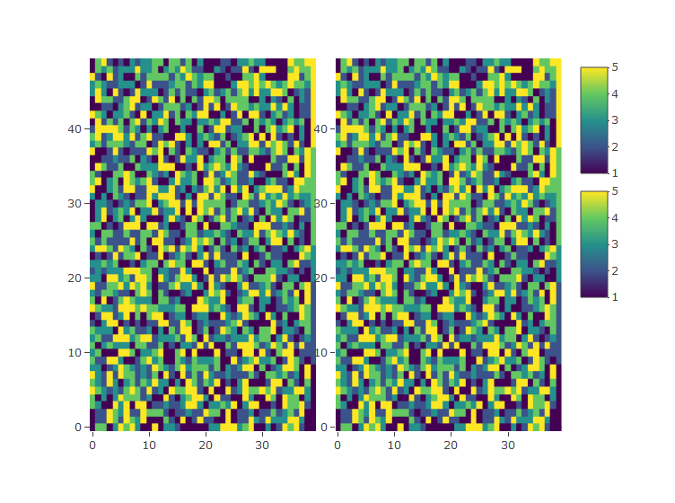

Get your stuff in order exercises
================
Han de Vries
1 March 2016


In the exercises below we cover the basics of ordering vectors, matrices
and data frames. We consider both column-wise and row-wise ordering,
single and multiple variables, ascending and descending sorting, and
sorting based on numeric, character and factor variables. Before
proceeding, it might be helpful to look over the help pages for the
`sort`, `order`, and `xtfrm` functions.

Answers to the exercises are available
[here](http://www.r-exercises.com/2016/03/01/get-your-stuff-in-order-solutions/).

If you obtained a different (correct) answer than those listed on the
solutions page, please feel free to post your answer as a comment on
that page.

## Exercise 1

Sort the vector `x <- c(1, 3, 2, 5, 4)` in:

1.  ascending order  
2.  descending order

<!-- end list -->

``` r
x <- c(1, 3, 2, 5, 4)
# a. ascending order  
sort(x)
```

    ## [1] 1 2 3 4 5

``` r
# b. descending order  
sort(x, decreasing = TRUE)
```

    ## [1] 5 4 3 2 1

## Exercise 2

Sort the matrix `x <- matrix(1:100, ncol=10)`:  
a. in descending order by its second column (call the sorted matrix
x1)  
b. in descending order by its second row (call the sorted matrix x2)

``` r
x <- matrix(1:100, ncol=10)
x
```

    ##       [,1] [,2] [,3] [,4] [,5] [,6] [,7] [,8] [,9] [,10]
    ##  [1,]    1   11   21   31   41   51   61   71   81    91
    ##  [2,]    2   12   22   32   42   52   62   72   82    92
    ##  [3,]    3   13   23   33   43   53   63   73   83    93
    ##  [4,]    4   14   24   34   44   54   64   74   84    94
    ##  [5,]    5   15   25   35   45   55   65   75   85    95
    ##  [6,]    6   16   26   36   46   56   66   76   86    96
    ##  [7,]    7   17   27   37   47   57   67   77   87    97
    ##  [8,]    8   18   28   38   48   58   68   78   88    98
    ##  [9,]    9   19   29   39   49   59   69   79   89    99
    ## [10,]   10   20   30   40   50   60   70   80   90   100

``` r
# a. in descending order by its second column  
x1 <- x[order(x[, 2], decreasing = TRUE),]
x1
```

    ##       [,1] [,2] [,3] [,4] [,5] [,6] [,7] [,8] [,9] [,10]
    ##  [1,]   10   20   30   40   50   60   70   80   90   100
    ##  [2,]    9   19   29   39   49   59   69   79   89    99
    ##  [3,]    8   18   28   38   48   58   68   78   88    98
    ##  [4,]    7   17   27   37   47   57   67   77   87    97
    ##  [5,]    6   16   26   36   46   56   66   76   86    96
    ##  [6,]    5   15   25   35   45   55   65   75   85    95
    ##  [7,]    4   14   24   34   44   54   64   74   84    94
    ##  [8,]    3   13   23   33   43   53   63   73   83    93
    ##  [9,]    2   12   22   32   42   52   62   72   82    92
    ## [10,]    1   11   21   31   41   51   61   71   81    91

``` r
# b. in descending order by its second row  
x2 <- x[, order(x[2, ], decreasing = TRUE)]
x2
```

    ##       [,1] [,2] [,3] [,4] [,5] [,6] [,7] [,8] [,9] [,10]
    ##  [1,]   91   81   71   61   51   41   31   21   11     1
    ##  [2,]   92   82   72   62   52   42   32   22   12     2
    ##  [3,]   93   83   73   63   53   43   33   23   13     3
    ##  [4,]   94   84   74   64   54   44   34   24   14     4
    ##  [5,]   95   85   75   65   55   45   35   25   15     5
    ##  [6,]   96   86   76   66   56   46   36   26   16     6
    ##  [7,]   97   87   77   67   57   47   37   27   17     7
    ##  [8,]   98   88   78   68   58   48   38   28   18     8
    ##  [9,]   99   89   79   69   59   49   39   29   19     9
    ## [10,]  100   90   80   70   60   50   40   30   20    10

## Exercise 3

Sort only the first column of x in descending order.

``` r
x[, 1] <- sort(x[, 1], decreasing = TRUE)
x
```

    ##       [,1] [,2] [,3] [,4] [,5] [,6] [,7] [,8] [,9] [,10]
    ##  [1,]   10   11   21   31   41   51   61   71   81    91
    ##  [2,]    9   12   22   32   42   52   62   72   82    92
    ##  [3,]    8   13   23   33   43   53   63   73   83    93
    ##  [4,]    7   14   24   34   44   54   64   74   84    94
    ##  [5,]    6   15   25   35   45   55   65   75   85    95
    ##  [6,]    5   16   26   36   46   56   66   76   86    96
    ##  [7,]    4   17   27   37   47   57   67   77   87    97
    ##  [8,]    3   18   28   38   48   58   68   78   88    98
    ##  [9,]    2   19   29   39   49   59   69   79   89    99
    ## [10,]    1   20   30   40   50   60   70   80   90   100

## Exercise 4

Consider the `women` data.  
a. Confirm that the data are sorted in increasing order for both the
height and weight variable, without looking at the data.  
b. Create a new variable bmi, based on the following equation: BMI = (
Weight in Pounds / (Height in inches) x (Height in inches) ) x 703.
Check, again without looking at the data, whether BMI increases
monotonically with weight and height.  
c. Sort the dataframe on bmi, and its variable names alphabetically.

``` r
library(data.table)
dt <- women
setDT(dt)
sapply(dt, is.unsorted)
```

    ## height weight 
    ##  FALSE  FALSE

``` r
dt[, bmi := weight / height^2 * 703]
sapply(dt, is.unsorted)
```

    ## height weight    bmi 
    ##  FALSE  FALSE   TRUE

``` r
setorder(dt, bmi)
dt
```

    ##     height weight      bmi
    ##  1:     70    154 22.09429
    ##  2:     69    150 22.14871
    ##  3:     71    159 22.17358
    ##  4:     68    146 22.19680
    ##  5:     67    142 22.23791
    ##  6:     72    164 22.23997
    ##  7:     66    139 22.43274
    ##  8:     65    135 22.46272
    ##  9:     64    132 22.65527
    ## 10:     63    129 22.84883
    ## 11:     62    126 23.04318
    ## 12:     61    123 23.23811
    ## 13:     60    120 23.43333
    ## 14:     59    117 23.62856
    ## 15:     58    115 24.03240

## Exercise 5

Consider the `CO2` data.  
a. Sort the data based on the Plant variable, alphabetically. (Note that
Plant is a factor\!). Check that the data are sorted correctly by
printing the data on the screen.  
b. Sort the data based on the uptake (increasing) and Plant
(alphabetically) variables (in that order).  
c. Sort again, based on uptake (increasing) and Plant (reversed
alphabetically), in that order.

``` r
dt <- CO2
setDT(dt)
# a. Sort the data based on the Plant variable, alphabetically.
dt$Plant <- factor(dt$Plant, levels = sort(levels(dt$Plant)))
setorder(dt, Plant)
head(dt)
```

    ##    Plant        Type Treatment conc uptake
    ## 1:   Mc1 Mississippi   chilled   95   10.5
    ## 2:   Mc1 Mississippi   chilled  175   14.9
    ## 3:   Mc1 Mississippi   chilled  250   18.1
    ## 4:   Mc1 Mississippi   chilled  350   18.9
    ## 5:   Mc1 Mississippi   chilled  500   19.5
    ## 6:   Mc1 Mississippi   chilled  675   22.2

``` r
# b. Sort the data based on the uptake (increasing) and Plant (alphabetically) variables.
setorderv(dt, c("uptake", "Plant"))
head(dt)
```

    ##    Plant        Type  Treatment conc uptake
    ## 1:   Mc2 Mississippi    chilled   95    7.7
    ## 2:   Qc2      Quebec    chilled   95    9.3
    ## 3:   Mc1 Mississippi    chilled   95   10.5
    ## 4:   Mc3 Mississippi    chilled   95   10.6
    ## 5:   Mn1 Mississippi nonchilled   95   10.6
    ## 6:   Mn3 Mississippi nonchilled   95   11.3

``` r
# c, Sort again, based on uptake (increasing) and Plant (reversed alphabetically).
setorderv(dt, c("uptake", "Plant"), c(1, -1))
head(dt)
```

    ##    Plant        Type  Treatment conc uptake
    ## 1:   Mc2 Mississippi    chilled   95    7.7
    ## 2:   Qc2      Quebec    chilled   95    9.3
    ## 3:   Mc1 Mississippi    chilled   95   10.5
    ## 4:   Mn1 Mississippi nonchilled   95   10.6
    ## 5:   Mc3 Mississippi    chilled   95   10.6
    ## 6:   Mn3 Mississippi nonchilled   95   11.3

## Exercise 6

Create a dataframe df with 40 columns, as follows:  
`df <- as.data.frame(matrix(sample(1:5, 2000, T), ncol=40))`  
a. Sort the dataframe on all 40 columns, from left to right, in
increasing order.  
b. Sort the dataframe on all 40 columns, from left to right, in
decreasing order.  
c. Sort the dataframe on all 40 columns, from right to left, in
increasing order.

``` r
library(plotly)
df <- as.data.frame(matrix(sample(1:5, 2000, T), ncol = 40))
# A.
# Answer by author
adf <- df[do.call(order, df), ]
# My solution
setDT(df)
setorderv(df, cols = colnames(df))
# Compare
subplot(plot_ly(z = data.matrix(adf), type = "heatmap"), 
        plot_ly(z = data.matrix(df), type = "heatmap"))
```

<!-- -->

``` r
# B.
# Answer by author
bdf <- df[do.call(order, -df), ]
# My solution
setorderv(df, cols = colnames(df), order = -1)
# Compare
subplot(plot_ly(z = data.matrix(bdf), type = "heatmap"), 
        plot_ly(z = data.matrix(df), type = "heatmap"))
```

<!-- -->

``` r
# C.
# Answer by author
cdf <- df[do.call(order, rev(df)), ]
# My solution
setorderv(df, cols = rev(colnames(df)))
# Compare
subplot(plot_ly(z = data.matrix(cdf), type = "heatmap"), 
        plot_ly(z = data.matrix(df), type = "heatmap"))
```

<!-- -->
