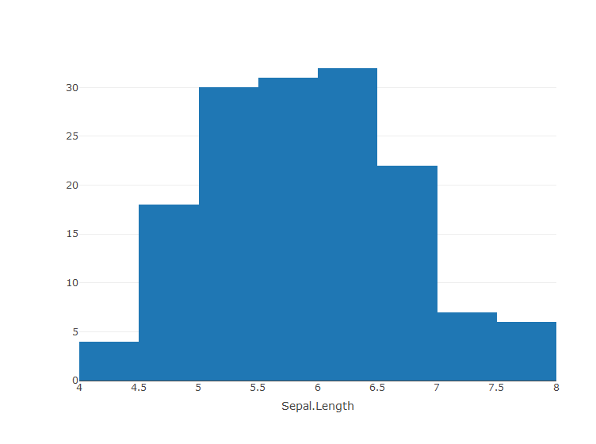

Getting started with Plotly: basic Plots
================
Sai Lalith
10 January 2017


Plotly is a d3 based graphing library used to produce interactive and
high quality graphs in R. In the following exercises, we will look at
the basic plots’ syntax and some basic features in the plotly
functions.  
We will use datasets available in base R packages.  
Refer to the documentation of the plotly packages when in need of help
with the functions and arguments.  
Also, refer to this [link](https://plot.ly/r/reference/) for figure
references  
Installation of the package is straight-forward as it is available on
CRAN.  
Use this command install.packages(‘plotly’) to install the package. Do
not forget to load the package before trying out the exercises.  
Answers to the exercises are available
[here](http://www.r-exercises.com/2017/01/10/getting-started-with-plotly-basic-plots-solutions/).

## Exercise 1

1.  Generate a histogram for the first column of iris dataset using the
    plot\_ly() function. For the first run, supply only one argument to
    the function and see the message it returns. identify the argument
    that you need to include to specify a chart type.

<!-- end list -->

``` r
library(plotly)
plot_ly(data = iris, x =~ Sepal.Length, type = "histogram")
```

<!-- -->

## Exercise 2

Identify the argument to specify number of bins and generate a histogram
with 20 bins using the same data.

Notice the behaviour of plot on mouse hover. There are also a few
options available on the right top corner of the plot to zoom, save the
plot
etc.

``` r
plot_ly(data = iris, x =~ Sepal.Length, type = "histogram", nbinsx = 20)
```

<!-- -->

## Exercise 3

1.  Generate a scatter plot for the first two columns of the iris
    dataset. Identify and use the appropriate arguments to get the plot
    with first column on the x axis and second column on y axis.  
2.  Using the color argument, specify the color such that data points
    are colored based on the Species column.

> HINT: color argument takes a vector of same length of number of data
> points data points with the level info.

``` r
plot_ly(data = iris, 
        x =~ Sepal.Length, 
        y =~ Sepal.Width,
        type = "scatter",
        mode = "markers",
        color =~ Species)
```

<!-- -->

## Exercise 4

To the same code in the previous exercise, use the size argument to
specify the markers’ size based on the third column of the iris dataset.

``` r
plot_ly(data = iris, 
        x =~ Sepal.Length, 
        y =~ Sepal.Width,
        type = "scatter",
        mode = "markers",
        color =~ Species,
        size =~ Petal.Length)
```

<!-- -->

## Exercise 5

1.  Generate a line plot for 100 values of random normal distribution
    with the default mean and standard deviation.

> HINT: Use index values on x axis. Use type=“scatter” and mode=“lines”
> to get a line chart

``` r
plot_ly(x = 1:100,
        y = rnorm(100),
        type = "scatter",
        mode = "lines")
```

<!-- -->

## Exercise 6

2.  Save the previous plot in an object p. Use layout function to add an
    appropriate title to the plot.

<!-- end list -->

``` r
p <- plot_ly(x = 1:100,
             y = rnorm(100),
             type = "scatter",
             mode = "lines")
p %>% layout(title = "Line plot")
```

<!-- -->

## Exercise 7

To learn how to generate a bar plot, we will simulate sample data and
look at how to prepare the data before plotting.  
Run the below code to generate the data.

    cat <- c(rep("A", 2), rep("B", 4), rep("C", 8))

Data has to be in the form of Levels and their Counts . Therefore, using
table() function to summarize and as.data.frame to create a data frame.

    df <- as.data.frame(table(cat))

1.  Now, using type=“bar” and the appropriate x and y arguments, create
    a bar graph.  
2.  Add color to each bar using color argument, based on the categorical
    levels.

<!-- end list -->

``` r
cat <- c(rep("A", 2), rep("B", 4), rep("C", 8))
df <- as.data.frame(table(cat))

plot_ly(data = df,
        x =~ cat,
        y =~ Freq,
        type = "bar",
        color =~ cat)
```

<!-- -->

## Exercise 8

Pie chart is an alternative way of representing categorical data, but,
when the levels in the data are more, bar chart is preferred.  
Data has to be prepared in the same way as we do it for bar chart. The
arguments vary a little. Instead of x and y, we use labels and values.

Generate a pie chart using the same data from the previous exercise and
appropriate arguments.  
Notice how the tick marks and the axes appear behind the chart.

``` r
plot_ly(data = df,
        labels =~ cat,
        values =~ Freq,
        type = "pie")
```

<!-- -->

## Exercise 9

For the first column in the iris dataset, generate a box plot using the
box trace type.

> HINT:For a simple box plot, just the y argument and type argumnets are
> given.

``` r
plot_ly(data = iris) %>% add_trace(y =~ Sepal.Length, type = "box")
```

<!-- -->

## Exercise 10

Add another argument to the code used in the previous exercies to
generate mutliple box plots for the first column of iris dataset, where
each box corresponds to data of particular Species.  
\> HINT : Remember the argument we used to specify the color for each
species in Exercise 3.

In the coming exercise sets on plotly, we will work on some advanced
plots and see how to use argumnets from the layout function to
manipulate the plot layout and settings.

``` r
plot_ly(data = iris,
        color =~ Species,
        y =~ Sepal.Length,
        type = "box")
```

<!-- -->
