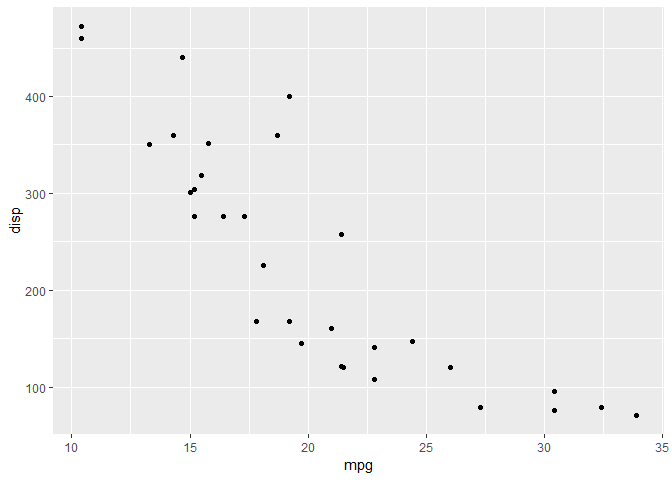
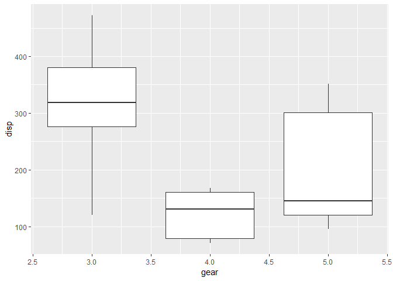
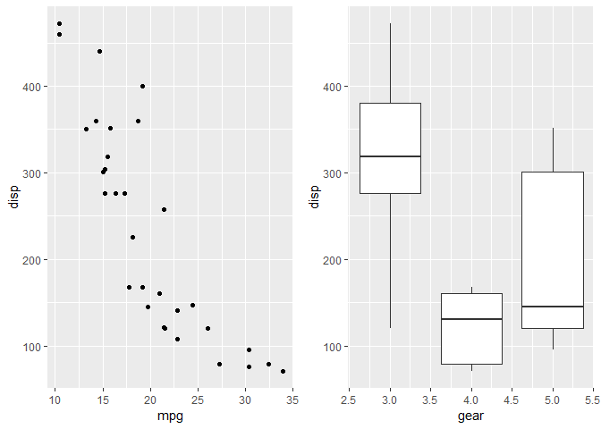
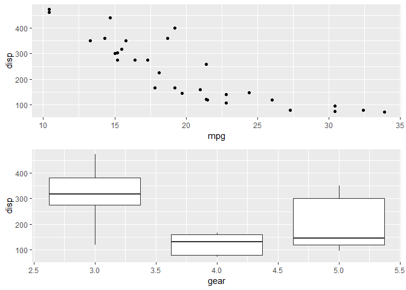
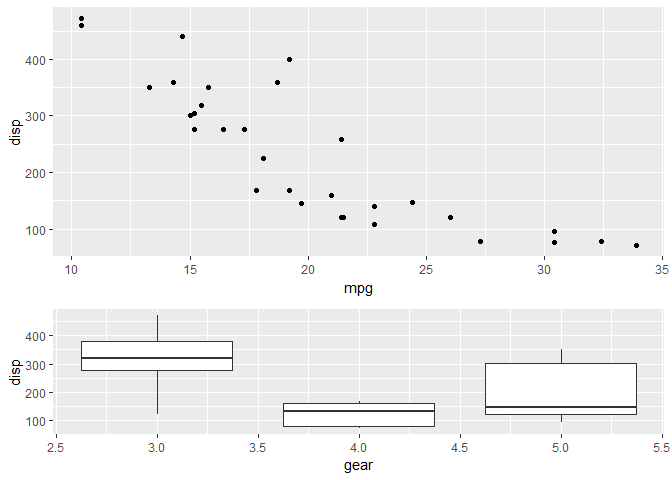
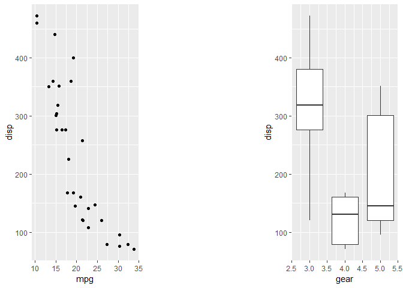
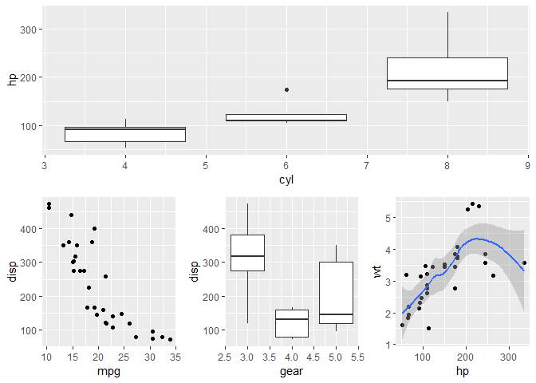
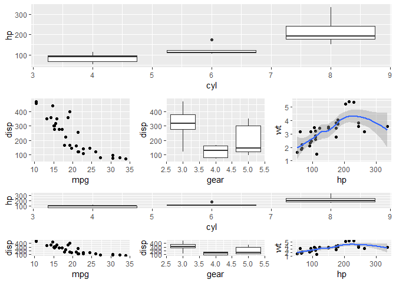
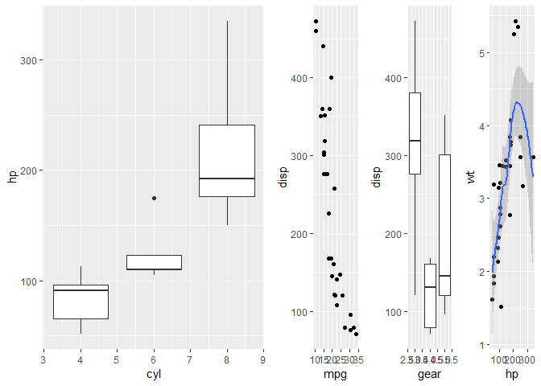

How To Plot With Patchwork: Exercises
================
Euthymios Kasvikis
2 June 2018

The goal of patchwork is to make it simple to combine separate ggplots
into the same graphic. It tries to solve the same problem as
gridExtra::grid.arrange() and cowplot::plot\_grid, but using an API that
incites exploration and iteration.

Before proceeding, please follow our short
[tutorial](http://r-exercises.com/2018/05/25/how-to-plot-with-patchwork/).

Look at the examples given and try to understand the logic behind them.
Then, try to solve the exercises below by using R without looking at the
answers. Then, check the
[solutions](http://r-exercises.com/2018/06/02/patchwork-exercises:-solutions)
to check your answers.

## Exercise 1

Create a scatter-plot object of `mtcars` between `mpg` and `disp`.

``` r
library(patchwork)
library(ggplot2)

ex1 <- ggplot(data = mtcars, aes(mpg, disp)) + geom_point()
ex1
```

<!-- -->

## Exercise 2

Create a box-plot object of `mtcars` between `gear` and `disp` grouped
by
`gear`.

``` r
ex2 <- ggplot(data = mtcars, aes(gear, disp, group = gear)) + geom_boxplot()
ex2
```

<!-- -->

## Exercise 3

Compose those two objects into one
graph.

``` r
ex1 + ex2
```

<!-- -->

## Exercise 4

Repeat the previous process but in one plotting
operation.

``` r
ggplot(data = mtcars, aes(mpg, disp)) + geom_point() + ggplot(data = mtcars, aes(gear, disp, group = gear)) + geom_boxplot()
```

<!-- -->

## Exercise 5

Display the composed graph in one column with the two graphs, one below
the
other.

``` r
ex1 + ex2 + plot_layout(ncol = 1)
```

<!-- -->

## Exercise 6

Set the graph on top to have two times the size of the graph at the
bottom.

``` r
ex1 + ex2 + plot_layout(ncol = 1, heights = c(2, 1))
```

<!-- -->

## Exercise 7

Add space between your
plots.

``` r
ex1 + plot_spacer() + ex2
```

<!-- -->

## Exercise 8

Create two objects of your choice (p3, p4) and display all of your four
objects in nested mode by putting p4 on top p1 and p2 and p3 at the
bottom (nested one below the other.)

``` r
p3 <- ggplot(data = mtcars, aes(hp, wt)) + geom_point() + geom_smooth()
p4 <- ggplot(data = mtcars, aes(cyl, hp, group = cyl)) + geom_boxplot()

nested1 <- p4 + {ex1 + ex2 + p3} + plot_layout(ncol = 1)
nested1
```

    ## `geom_smooth()` using method = 'loess' and formula 'y ~ x'

<!-- -->

## Exercise 9

Now, put the two nested plots next to each other.

``` r
nested1 + nested1
```

    ## `geom_smooth()` using method = 'loess' and formula 'y ~ x'
    ## `geom_smooth()` using method = 'loess' and formula 'y ~ x'

<!-- -->

## Exercise 10

Finally, display p4 in one column and the rest of your objects in
another.

``` r
p4 + {ex1 + ex2 + p3} + plot_layout(ncol = 2)
```

    ## `geom_smooth()` using method = 'loess' and formula 'y ~ x'

<!-- -->
