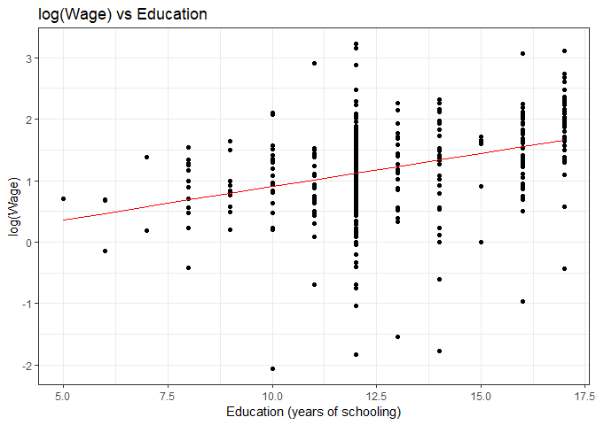
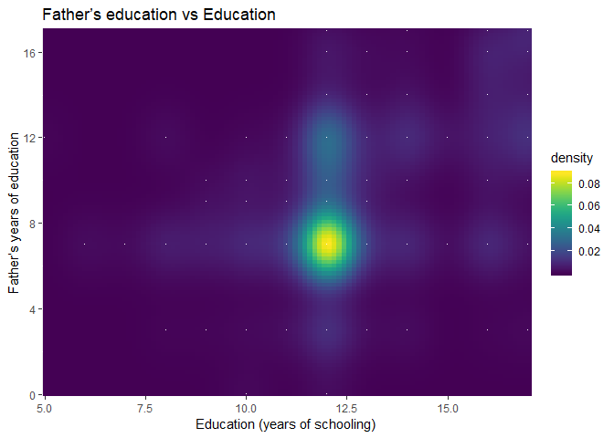

Instrumental Variables in R exercises (Part-1)
================
Bassalat Sajjad
15 May 2017


One of the most frequently encountered issues in econometrics is
endogeneity.  
Consider the simple Ordinary Least Squares (OLS) regression setting in
which we model wages as a function of years of schooling (education):

\[log(wage_{i}) = \beta_{0} + \beta_{1}education_{i} + e_{i}\]

One of the main assumption of OLS is that the independent variables are
not correlated with the error term. However, this is seldom the case in
most practical applications. The violation of this assumption causes the
beta estimates to be biased. In the above example, years of schooling
(education) is likely to be correlated with ‘individual ability’ which
is part of the error term. Therefore, estimating this model would give a
biased estimate of the beta parameter of education as it is considered
endogenous. One option is to obtain a measure of ability such as IQ and
have it as an independent variable in the model. Availability of such
data is not always possible.

A frequently used approach is the method of instrumental variables:
intuitively, we need to identify a variable (called instrumental
variable) that is not part of the model, has high correlation with the
endogenous variable and is uncorrelated with the error term. In our
example, one possible candidate for instrumental variable (IV) is
father’s education. The appropriateness of the IV is always debatable
and it would be a good thought experiment to see why father’s education
can fulfill the criteria for an IV we just defined and why it might
fail.

The following exercises provide a basic introduction to using
instrumental variable technique in R.

Answers to the exercises are available
[here](http://r-exercises.com/2017/05/15/instrumental-variables-in-r-exercises-part-1-solutions/).

## Exercise 1

Load the `AER` package (package description:
[here](https://cran.r-project.org/web/packages/AER/AER.pdf)). Next, load
`PSID1976` dataset provided with the AER package. This has data
regarding labor force participation of married women. The data is
sourced from:  
\> Mroz, T. A. (1987) The sensitivity of an empirical model of married
women’s hours of work to economic and statistical assumptions.
Econometrica 55, 765–799.

``` r
library(data.table)
library(AER)

data("PSID1976")
setDT(PSID1976)
```

## Exercise 2

Get `summary` statistics for the data and identify possible candidates
as instrumental variables for education.

``` r
summary(PSID1976)
```

    ##  participation     hours          youngkids         oldkids     
    ##  no :325       Min.   :   0.0   Min.   :0.0000   Min.   :0.000  
    ##  yes:428       1st Qu.:   0.0   1st Qu.:0.0000   1st Qu.:0.000  
    ##                Median : 288.0   Median :0.0000   Median :1.000  
    ##                Mean   : 740.6   Mean   :0.2377   Mean   :1.353  
    ##                3rd Qu.:1516.0   3rd Qu.:0.0000   3rd Qu.:2.000  
    ##                Max.   :4950.0   Max.   :3.0000   Max.   :8.000  
    ##       age          education          wage           repwage    
    ##  Min.   :30.00   Min.   : 5.00   Min.   : 0.000   Min.   :0.00  
    ##  1st Qu.:36.00   1st Qu.:12.00   1st Qu.: 0.000   1st Qu.:0.00  
    ##  Median :43.00   Median :12.00   Median : 1.625   Median :0.00  
    ##  Mean   :42.54   Mean   :12.29   Mean   : 2.375   Mean   :1.85  
    ##  3rd Qu.:49.00   3rd Qu.:13.00   3rd Qu.: 3.788   3rd Qu.:3.58  
    ##  Max.   :60.00   Max.   :17.00   Max.   :25.000   Max.   :9.98  
    ##      hhours          hage         heducation        hwage        
    ##  Min.   : 175   Min.   :30.00   Min.   : 3.00   Min.   : 0.4121  
    ##  1st Qu.:1928   1st Qu.:38.00   1st Qu.:11.00   1st Qu.: 4.7883  
    ##  Median :2164   Median :46.00   Median :12.00   Median : 6.9758  
    ##  Mean   :2267   Mean   :45.12   Mean   :12.49   Mean   : 7.4822  
    ##  3rd Qu.:2553   3rd Qu.:52.00   3rd Qu.:15.00   3rd Qu.: 9.1667  
    ##  Max.   :5010   Max.   :60.00   Max.   :17.00   Max.   :40.5090  
    ##     fincome           tax           meducation       feducation    
    ##  Min.   : 1500   Min.   :0.4415   Min.   : 0.000   Min.   : 0.000  
    ##  1st Qu.:15428   1st Qu.:0.6215   1st Qu.: 7.000   1st Qu.: 7.000  
    ##  Median :20880   Median :0.6915   Median :10.000   Median : 7.000  
    ##  Mean   :23081   Mean   :0.6789   Mean   : 9.251   Mean   : 8.809  
    ##  3rd Qu.:28200   3rd Qu.:0.7215   3rd Qu.:12.000   3rd Qu.:12.000  
    ##  Max.   :96000   Max.   :0.9415   Max.   :17.000   Max.   :17.000  
    ##      unemp         city       experience    college   hcollege 
    ##  Min.   : 3.000   no :269   Min.   : 0.00   no :541   no :458  
    ##  1st Qu.: 7.500   yes:484   1st Qu.: 4.00   yes:212   yes:295  
    ##  Median : 7.500             Median : 9.00                      
    ##  Mean   : 8.624             Mean   :10.63                      
    ##  3rd Qu.:11.000             3rd Qu.:15.00                      
    ##  Max.   :14.000             Max.   :45.00

## Exercise 3

Regress `log(wage)` on `education`. Why do you get an error message?
(Hint: focus on the `participation` variable)

``` r
# model1 <- lm(log(wage) ~ education, data = PSID1976)
```

> Error in lm.fit(x, y, offset = offset, singular.ok = singular.ok, …):
> NA/NaN/Inf in ‘y’ 325 women are not employed. Subsequently, for these
> women log(0) is not defined.

## Exercise 4

Regress `log(wage)` on `education` and state the estimated return to
another year of education for women that participated in the labor
force. (Hint: use the `subset` command)

> Note: the following exercises are based on the subsample of 428
> working women used on
exercise-4.

``` r
model2 <- lm(log(wage) ~ education, data = PSID1976[participation == "yes"])
summary(model2)
```

    ## 
    ## Call:
    ## lm(formula = log(wage) ~ education, data = PSID1976[participation == 
    ##     "yes"])
    ## 
    ## Residuals:
    ##      Min       1Q   Median       3Q      Max 
    ## -3.10256 -0.31473  0.06434  0.40081  2.10029 
    ## 
    ## Coefficients:
    ##             Estimate Std. Error t value Pr(>|t|)    
    ## (Intercept)  -0.1852     0.1852  -1.000    0.318    
    ## education     0.1086     0.0144   7.545 2.76e-13 ***
    ## ---
    ## Signif. codes:  0 '***' 0.001 '**' 0.01 '*' 0.05 '.' 0.1 ' ' 1
    ## 
    ## Residual standard error: 0.68 on 426 degrees of freedom
    ## Multiple R-squared:  0.1179, Adjusted R-squared:  0.1158 
    ## F-statistic: 56.93 on 1 and 426 DF,  p-value: 2.761e-13

## Exercise 5

Plot `log(wage)` against `education` along with the fitted regression
line from exercise-4.

``` r
library(ggplot2)
ggplot(data = PSID1976[participation == "yes"], aes(x = education, y = log(wage))) +
  geom_point() +
  geom_line(aes(x = education, y = model2$fitted.values), color = "red") +
  labs(x = "Education (years of schooling)", y = "log(Wage)", title = "log(Wage) vs Education") +
  theme_bw()
```

<!-- -->

## Exercise 6

Regress `education` on `feducation` (father’s years of education) and
comment on the estimated
correlation.

``` r
model3 <- lm(education ~ feducation, data = PSID1976[participation == "yes"])
summary(model3)
```

    ## 
    ## Call:
    ## lm(formula = education ~ feducation, data = PSID1976[participation == 
    ##     "yes"])
    ## 
    ## Residuals:
    ##     Min      1Q  Median      3Q     Max 
    ## -8.4704 -1.1231 -0.1231  0.9546  5.9546 
    ## 
    ## Coefficients:
    ##             Estimate Std. Error t value Pr(>|t|)    
    ## (Intercept) 10.23705    0.27594  37.099   <2e-16 ***
    ## feducation   0.26944    0.02859   9.426   <2e-16 ***
    ## ---
    ## Signif. codes:  0 '***' 0.001 '**' 0.01 '*' 0.05 '.' 0.1 ' ' 1
    ## 
    ## Residual standard error: 2.081 on 426 degrees of freedom
    ## Multiple R-squared:  0.1726, Adjusted R-squared:  0.1706 
    ## F-statistic: 88.84 on 1 and 426 DF,  p-value: < 2.2e-16

``` r
library(viridis)
```

    ## Loading required package: viridisLite

``` r
ggplot(data = PSID1976[participation == "yes"], aes(x = education, y = feducation)) +
  stat_density2d(geom = "raster", aes(fill = stat(density)), contour = FALSE) +
  scale_fill_viridis() +
  coord_cartesian(expand = FALSE) +
  geom_point(shape = '.', col = 'white') +
  labs(x = "Education (years of schooling)", 
       y = "Father’s years of education", 
       title = "Father’s education vs Education")
```

<!-- -->

> The estimated coefficient of ‘feducation’ is positive and significant.

## Exercise 7

The IV estimate of the return to education can be found using the
two-stage least squares (2SLS) procedure.  
Regress `log(wage)` on the fitted values of the model estimated in
exercise-6.  
The beta parameter for the fitted values is the IV estimate for return
to education.  
Note that the associated standard errors reported are incorrect as these
are not based on the usual OLS formula.

``` r
model4 <- lm(log(wage) ~ fitted.values(model3),
             data = PSID1976[participation == "yes"])
summary(model4)
```

    ## 
    ## Call:
    ## lm(formula = log(wage) ~ fitted.values(model3), data = PSID1976[participation == 
    ##     "yes"])
    ## 
    ## Residuals:
    ##     Min      1Q  Median      3Q     Max 
    ## -3.2126 -0.3763  0.0563  0.4173  2.0604 
    ## 
    ## Coefficients:
    ##                       Estimate Std. Error t value Pr(>|t|)
    ## (Intercept)            0.44110    0.46711   0.944    0.346
    ## fitted.values(model3)  0.05917    0.03680   1.608    0.109
    ## 
    ## Residual standard error: 0.7219 on 426 degrees of freedom
    ## Multiple R-squared:  0.006034,   Adjusted R-squared:  0.003701 
    ## F-statistic: 2.586 on 1 and 426 DF,  p-value: 0.1086

## Exercise 8

The `ivreg` function provides a convenient way to estimate IV models and
get correct standard errors.  
Using the `ivreg` function, regress `log(wage)` on education and specify
feducation as the IV. Do you get the same beta estimates as in
exercise-6?

``` r
model5 <- ivreg(log(wage) ~ education | feducation,
                data = PSID1976[participation == "yes"])
summary(model5)
```

    ## 
    ## Call:
    ## ivreg(formula = log(wage) ~ education | feducation, data = PSID1976[participation == 
    ##     "yes"])
    ## 
    ## Residuals:
    ##     Min      1Q  Median      3Q     Max 
    ## -3.0870 -0.3393  0.0525  0.4042  2.0677 
    ## 
    ## Coefficients:
    ##             Estimate Std. Error t value Pr(>|t|)  
    ## (Intercept)  0.44110    0.44610   0.989   0.3233  
    ## education    0.05917    0.03514   1.684   0.0929 .
    ## ---
    ## Signif. codes:  0 '***' 0.001 '**' 0.01 '*' 0.05 '.' 0.1 ' ' 1
    ## 
    ## Residual standard error: 0.6894 on 426 degrees of freedom
    ## Multiple R-Squared: 0.09344, Adjusted R-squared: 0.09131 
    ## Wald test: 2.835 on 1 and 426 DF,  p-value: 0.09294

## Exercise 9

Get 90% confidence intervals for the return to education from exercises
4 and 8.

``` r
confint(model2, 'education', level = 0.90)
```

    ##                  5 %      95 %
    ## education 0.08491139 0.1323859

``` r
confint(model5, 'education', level = 0.90)
```

    ##                   5 %      95 %
    ## education 0.001370406 0.1169766

## Exercise 10

Repeat exercises 6 and 8 using mother’s education (`meducation`) as the
IV and comment on the results.

``` r
model6 <- lm(education ~ meducation,
             data = PSID1976[participation == "yes"])
summary(model6)
```

    ## 
    ## Call:
    ## lm(formula = education ~ meducation, data = PSID1976[participation == 
    ##     "yes"])
    ## 
    ## Residuals:
    ##     Min      1Q  Median      3Q     Max 
    ## -7.3229 -1.3229  0.0139  1.0834  6.0834 
    ## 
    ## Coefficients:
    ##             Estimate Std. Error t value Pr(>|t|)    
    ## (Intercept) 10.11449    0.31090  32.532   <2e-16 ***
    ## meducation   0.26737    0.03086   8.663   <2e-16 ***
    ## ---
    ## Signif. codes:  0 '***' 0.001 '**' 0.01 '*' 0.05 '.' 0.1 ' ' 1
    ## 
    ## Residual standard error: 2.11 on 426 degrees of freedom
    ## Multiple R-squared:  0.1498, Adjusted R-squared:  0.1478 
    ## F-statistic: 75.05 on 1 and 426 DF,  p-value: < 2.2e-16

``` r
model7 <- ivreg(log(wage) ~ education | meducation,
                data = PSID1976[participation == "yes"])
summary(model7)
```

    ## 
    ## Call:
    ## ivreg(formula = log(wage) ~ education | meducation, data = PSID1976[participation == 
    ##     "yes"])
    ## 
    ## Residuals:
    ##      Min       1Q   Median       3Q      Max 
    ## -3.14184 -0.34291  0.05939  0.39750  2.05410 
    ## 
    ## Coefficients:
    ##             Estimate Std. Error t value Pr(>|t|)
    ## (Intercept)  0.70217    0.48510   1.447    0.148
    ## education    0.03855    0.03823   1.008    0.314
    ## 
    ## Residual standard error: 0.6987 on 426 degrees of freedom
    ## Multiple R-Squared: 0.06881, Adjusted R-squared: 0.06663 
    ## Wald test: 1.017 on 1 and 426 DF,  p-value: 0.3138

> The IV estimate of return to education is not significantly different
> from zero. No conclusions can be drawn from this result.
