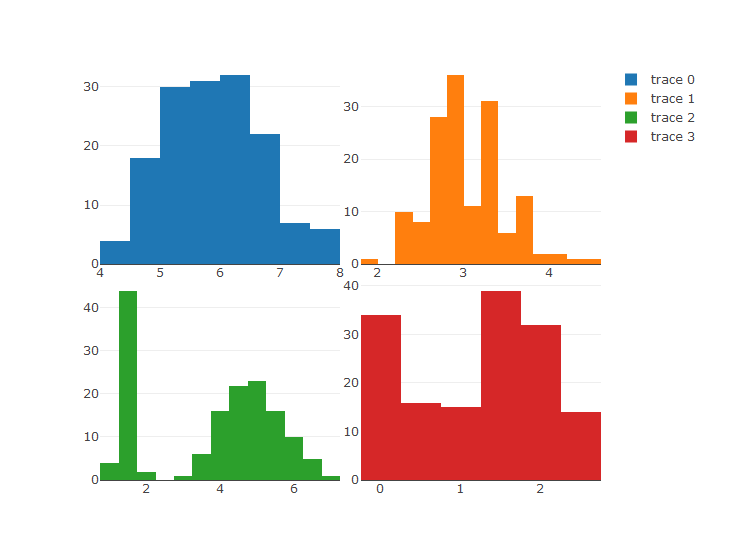
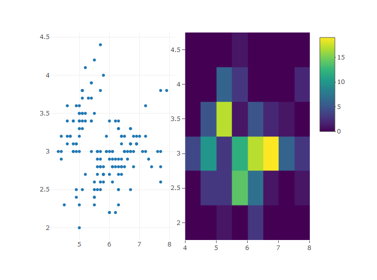
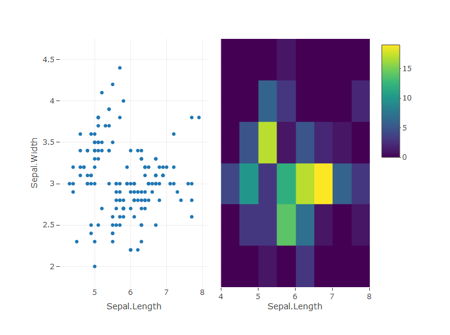
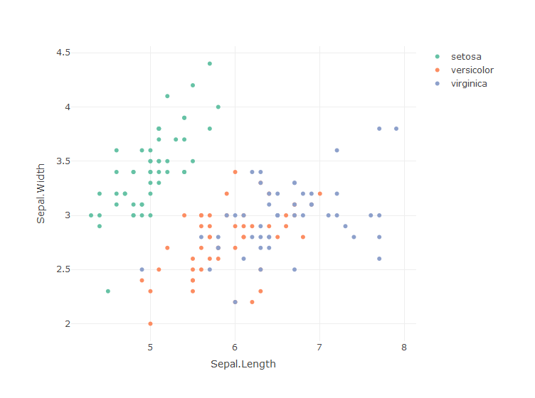
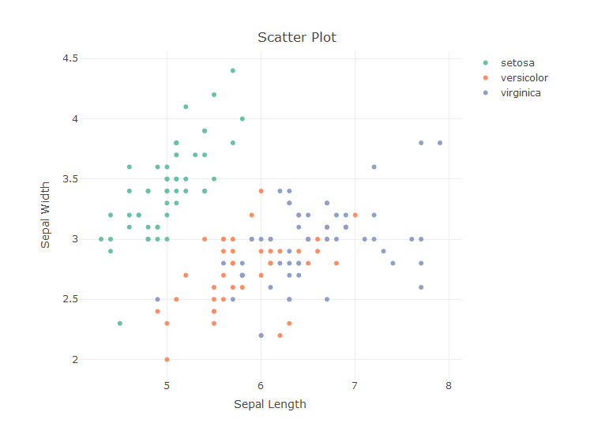
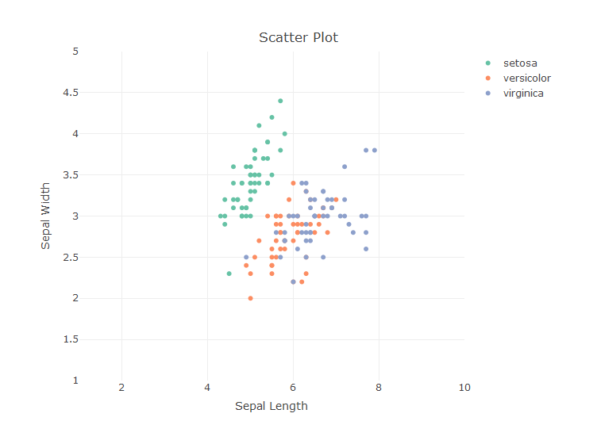
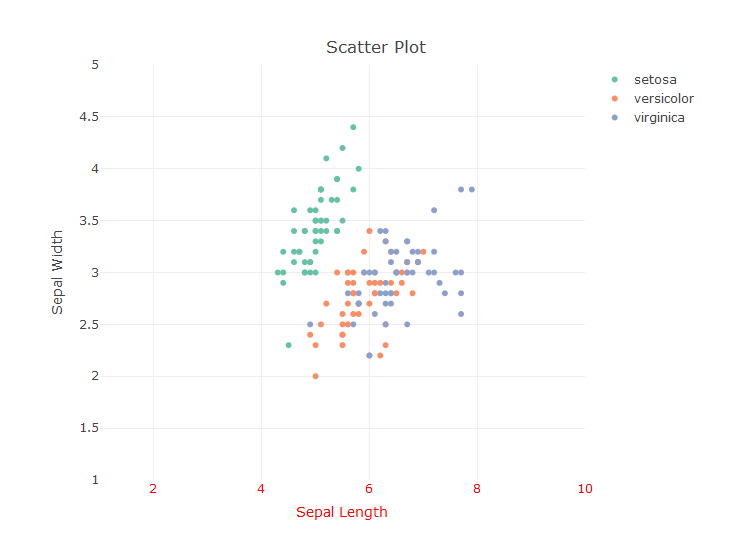

Plotly: Advanced plots and features
================
Sai Lalith
19 January 2017


Plotly is a d3 based graphing library used to produce interactive and
high quality graphs in R. In the following exercises, we will look at
some advanced plots and features avaialable in the package. Please note
that the list here is not exhaustive.  
We will use datasets available in base R packages.

You are expected to have the knowledge of generating basic plots using
plotly package before attempting
[this](http://www.r-exercises.com/2017/01/10/getting-started-with-plotly-basic-plots/)
exercise set. It is recommended that you go through this exercise set to
test your knowledge on plotly basics.

Answers to the exercises are available
[here](http://www.r-exercises.com/2017/01/19/plotly-advanced-plots-and-features-solutions).

Refer to this [link](https://plot.ly/r/reference/) for more help on the
plotly functions.  
For a quick info on the functions and arguments required to build basic
plotly plots, refer to this [cheat
sheet](https://images.plot.ly/plotly-documentation/images/r_cheat_sheet.pdf).

## Exercise 1

Install and load the latest version of plotly package.

Generate separate histograms for the first four columns of iris dataset
and save the plots in objects p1, p2, p3 and p4.

> HINT: Use plot\_ly() function with x argument and type=“histogram”.
> Use name argument to give appropriate name for the trace.

``` r
library(plotly)
p1 <- plot_ly(data = iris, x =~ Sepal.Length, type = "histogram")
p2 <- plot_ly(data = iris, x =~ Sepal.Width, type = "histogram")
p3 <- plot_ly(data = iris, x =~ Petal.Length, type = "histogram")
p4 <- plot_ly(data = iris, x =~ Petal.Width, type = "histogram")
```

## Exercise 2

1.  Use subplot() function to generate a plot with all the plot objects
    from previous exercise as the arguments.

2.  Use the nrows argument to arrange 2 plots per
row.

<!-- end list -->

``` r
subplot(p1, p2, p3, p4, nrows = 2)
```

<!-- -->

## Exercise 3

1.  Generate a scatter plot for the iris dataset with first column on
    the x-axis and second column on the y-axis. Save the plot object.

2.  Generate a 2d histogram using the add\_histogram2d() function.Save
    the plot object.

> HINT: Use the function plot\_ly() with the same x and y arguments and
> pass the plot object to the 2-d histogram function.

``` r
ex3.a <- plot_ly(data = iris, 
                 x =~ Sepal.Length, 
                 y =~ Sepal.Width, 
                 type = "scatter",
                 mode = "markers")
ex3.b <- plot_ly(data = iris, 
                 x =~ Sepal.Length, 
                 y =~ Sepal.Width) %>% add_histogram2d()
```

## Exercise 4

Generate a subplot with the scatter plot and the 2-d histogram created
in the previous exercise.

Notice how the scatter plot can be represented in a more interesting
way. Cells in the 2-d histogram are binned and represented with the
color on the scale based on the cell
population/density.

``` r
subplot(ex3.a, ex3.b)
```

<!-- -->

## Exercise 5

Set the value of `shareX` and `shareY` arguments in the subplot()
function to scale the plots to the same range of `x` and `y`.

``` r
subplot(ex3.a, ex3.b,
        shareX = TRUE,
        shareY = TRUE)
```

<!-- -->

## Exercise 6

Now, let us build a 3-d surface plot. The syntax to build such plot is
as below.  
`plot_ly(z = matrix(1:100, nrow = 10)) %>% add_surface()` Click, hold
and drag the cursor to see the plot surface.

Build a 3-d surface plot using the volcano dataset available in the base
R
distribution.

``` r
plot_ly(z = volcano) %>% add_surface()
```

<!-- -->

## Exercise 7

Let’s look at few helpful and commonly used arguments from the
`layout()` function.

Create and save a scatter plot object with first and second columns of
iris dataset as `x` and `y` arguments respectively. Colour the markers
based on the `species`

``` r
ex7 <- plot_ly(data = iris, 
               x =~ Sepal.Length, 
               y =~ Sepal.Width, 
               type = "scatter",
               mode = "markers",
               color =~ Species)
ex7
```

<!-- -->

## Exercise 8

1.  Add an appropriate title to the plot using the layout function and
    title argument.  
2.  Add an appropriate x-axis label using the xaxis argument. xaxis
    takes a list of attribute values. Refer to the R reference page for
    more help.  
3.  Add an appropriate y-axis label.

<!-- end list -->

``` r
ex7 %>% layout(title = "Scatter Plot",
               xaxis = list(title = "Sepal Length"),
               yaxis = list(title = "Sepal Width"))
```

<!-- -->

## Exercise 9

1.  Use the range attribute in the list of values given to the xaxis
    argument to set the x-axis range from 1 to 10.  
2.  Similarly, set the y-axis range from 1 to 5.

<!-- end list -->

``` r
ex7 %>% layout(title = "Scatter Plot",
               xaxis = list(title = "Sepal Length",
                            range = c(1, 10)),
               yaxis = list(title = "Sepal Width",
                            range = c(1, 5)))
```

<!-- -->

## Exercise 10

Try different layout options to further customize the font, axes etc… of
the plot.

``` r
ex7 %>% layout(title = "Scatter Plot",
               xaxis = list(title = "Sepal Length",
                            range = c(1, 10),
                            family = "Arial, sans-serif",
                            size = 18,
                            color = "red"),
               yaxis = list(title = "Sepal Width",
                            range = c(1, 5)))
```

<!-- -->
