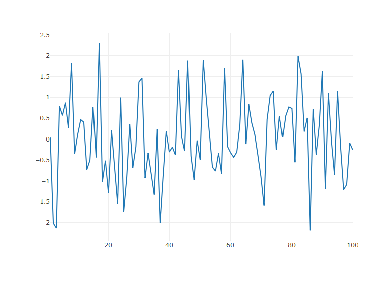
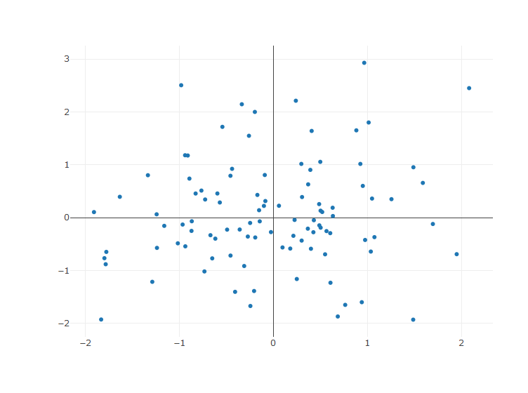
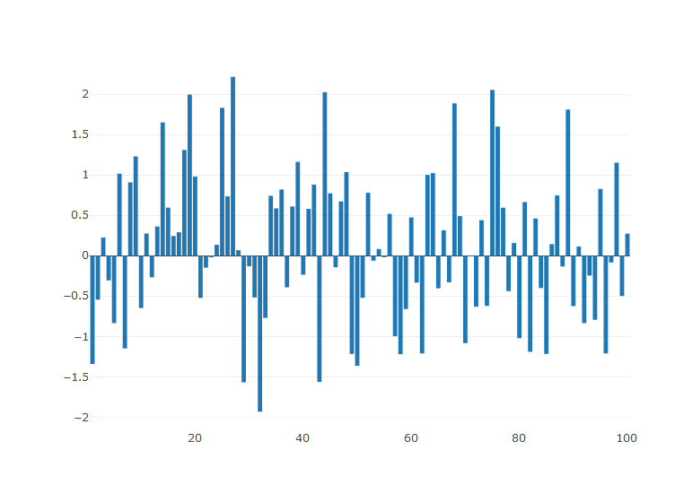
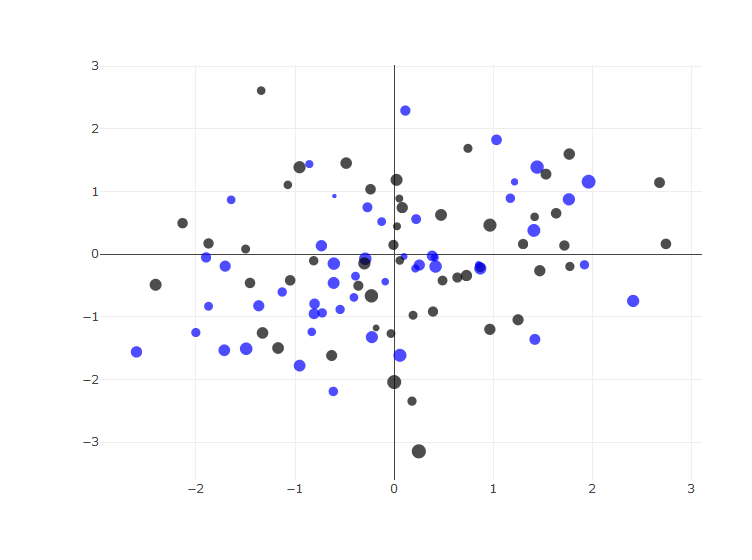
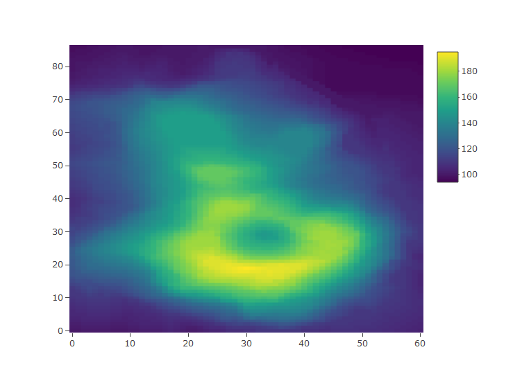
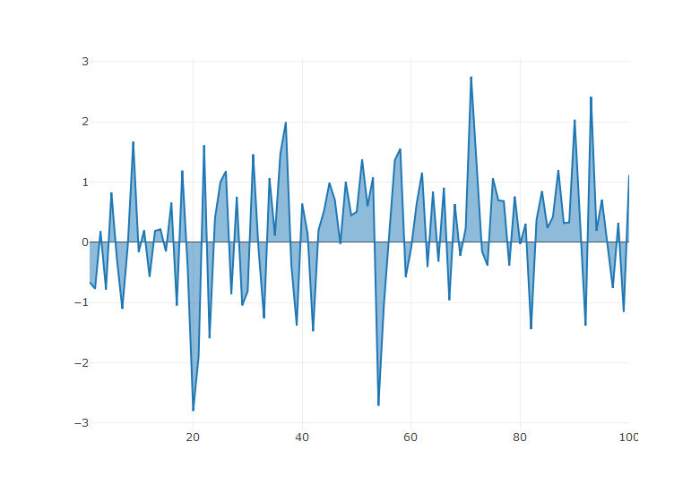
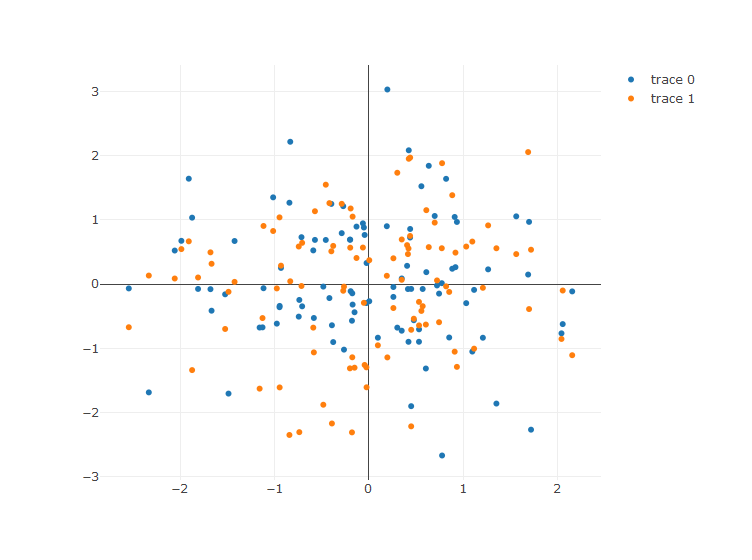
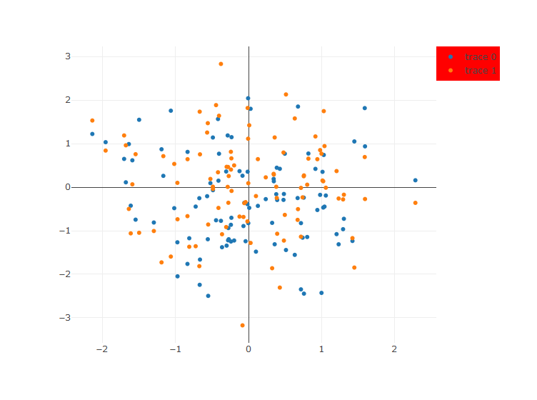
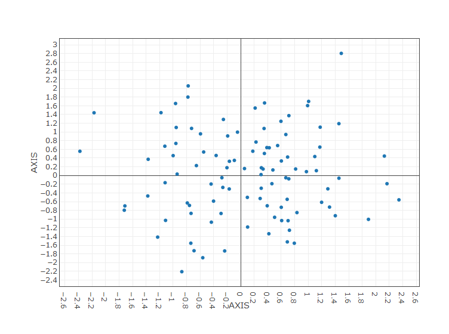
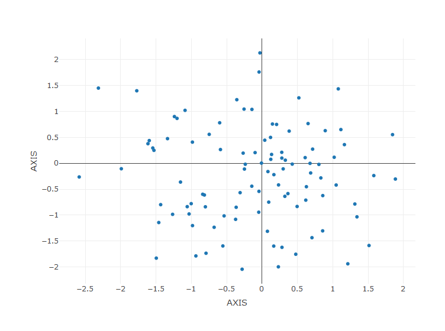

Plotly basic charts – exercises
================
Euthymios Kasvikis
5 October 2017


Plotly’s R graphing library makes interactive, publication-quality web
graphs. More specifically it gives us the ability to make line plots,
scatter plots, area charts, bar charts, error bars, box plots,
histograms, heatmaps, subplots, multiple-axes, and 3D charts.

In this tutorial we are going to make a first step in plotly’s world by
learning to create some basic charts enhanced with proper layouts that
the plotly package provides.

Before proceeding, please follow our short
[tutorial](http://r-exercises.com/2017/09/28/how-to-plot-basic-charts-with-plotly/).

Look at the examples given and try to understand the logic behind them.
Then try to solve the exercises below using R and without looking at the
answers. Then check the
[solutions](http://r-exercises.com/2017/10/05/plotly-basic-charts-exercises-solutions/).
to check your answers.

For other parts of this series follow the tag [plotly
visualizations](http://r-exercises.com/tag/plotly-visualizations)

## Exercise 1

Create a `line` plot of `x` and `y`.  
\> HINT: Use `mode = "lines"`.

``` r
library(plotly)
plot_ly(x = 1:100, y = rnorm(100), mode = "lines")
```

<!-- -->

## Exercise 2

Create a `scatter` plot of `x` and `y`.  
\> HINT: Use `mode =
"markers"`.

``` r
plot_ly(x = rnorm(100), y = rnorm(100), type = "scatter", mode = "markers")
```

<!-- -->

## Exercise 3

Create a `bar` plot of `x` and `y`.  
\> HINT: Use type =
“bar”.

``` r
plot_ly(x = 1:100, y = rnorm(100), type = "bar")
```

<!-- -->

## Exercise 4

Create a bubble chart of `x` and `y`. Choose `size` and `color` of your
choice for every marker. \> HINT: Use `size` and `color`.

``` r
plot_ly(x = rnorm(100), 
        y = rnorm(100), 
        type = "scatter",
        mode = "markers",
        size = rnorm(100),
        marker = list(color = rep(c("blue", "black"), 50)))
```

<!-- -->

## Exercise 5

Create a `heatmap` of the “`volcano`” dataset.  
\> HINT: Use z.

``` r
plot_ly(z = volcano,
        type = "heatmap")
```

<!-- -->

## Exercise 6

Create an area plot of `x` and `y`.  
\> HINT: Use `fill = "tozeroy"`.

``` r
plot_ly(x = 1:100, 
        y = rnorm(100), 
        type = "scatter",
        mode = "lines",
        fill = "tozeroy")
```

<!-- -->

## Exercise 7

Add `y3` to the scatterplot of Exercise 2. Then create your scatter plot
with trace.  
\> HINT: Use
`add_trace()`.

``` r
plot_ly(x = rnorm(100), y = rnorm(100), type = "scatter", mode = "markers") %>%
  add_trace(y = rnorm(100))
```

<!-- -->

## Exercise 8

Transform the trace you added in Exercise 7 into `legend` with
`coordinates(1,1)` and `red` color. \> HINT: Use
`layout()`.

``` r
plot_ly(x = rnorm(100), y = rnorm(100), type = "scatter", mode = "markers") %>%
  add_trace(y = rnorm(100)) %>%
  layout(legend = list(x = 1,
                       y = 1,
                       bgcolor = "red" 
                       )
         )
```

<!-- -->

## Exercise 9

Add axes to the scatterplot you built in Exercise 2. Set `nticks` to
`40`, add `showline`, give a `title` and set `mirror` to “`all`”.  
\> HINT: Use `list()`.

``` r
anno <- list(nticks = 40,
             showline = TRUE,
             title = "AXIS",
             mirror = "all" )

plot_ly(x = rnorm(100), y = rnorm(100), type = "scatter", mode = "markers") %>%
  layout(xaxis = anno, yaxis = anno)
```

<!-- -->

## Exercise 10

Now add `showgrid`, `zeroline`, set `nticks` to 20 and remove `showline`
to spot the differences.

``` r
anno <- list(nticks = 20,
             showgrid = TRUE,
             showline = FALSE,
             zeroline = TRUE,
             title = "AXIS",
             mirror = "all")

plot_ly(x = rnorm(100), y = rnorm(100), type = "scatter", mode = "markers") %>%
  layout(xaxis = anno, yaxis = anno)
```

<!-- -->
