Predicting Housing Prices with Linear Regression Exercises
================
Thomas Pinder
4 December 2017


Regression techniques are a crucial skill in any data scientist or
statisticians toolkit. It is even crucial for people who are unfamiliar
with regression modeling. It is a nice way to introduce yourself to the
topic through a simple linear model.

A linear model is an explanation of how a continuous response variable
behaves, dependent on a set of covariates or explanatory variables.
Whilst often insufficient to explain complex problems, linear models do
present underlying skills, such as variable selection and diagnostic
examinations. Therefore, a worthwhile introduction to statistical
regression techniques.

In this tutorial, we’ll be creating a couple of linear models and
comparing the performance of them on the Boston Housing dataset. This
tutorial will require caret and mlbench to be installed and you may find
ggplot2 and dplyr useful too, though these are not essential.

Solutions to these exercises can be found
[here](https://www.r-exercises.com/2017/12/04/boston-regression-solutions/).

## Exercise 1

Load the Boston Housing dataset from the `mlbench` library and inspect
the different types of variables present.

``` r
library(mlbench)
data("BostonHousing")
housing <- BostonHousing
str(housing)
```

    ## 'data.frame':    506 obs. of  14 variables:
    ##  $ crim   : num  0.00632 0.02731 0.02729 0.03237 0.06905 ...
    ##  $ zn     : num  18 0 0 0 0 0 12.5 12.5 12.5 12.5 ...
    ##  $ indus  : num  2.31 7.07 7.07 2.18 2.18 2.18 7.87 7.87 7.87 7.87 ...
    ##  $ chas   : Factor w/ 2 levels "0","1": 1 1 1 1 1 1 1 1 1 1 ...
    ##  $ nox    : num  0.538 0.469 0.469 0.458 0.458 0.458 0.524 0.524 0.524 0.524 ...
    ##  $ rm     : num  6.58 6.42 7.18 7 7.15 ...
    ##  $ age    : num  65.2 78.9 61.1 45.8 54.2 58.7 66.6 96.1 100 85.9 ...
    ##  $ dis    : num  4.09 4.97 4.97 6.06 6.06 ...
    ##  $ rad    : num  1 2 2 3 3 3 5 5 5 5 ...
    ##  $ tax    : num  296 242 242 222 222 222 311 311 311 311 ...
    ##  $ ptratio: num  15.3 17.8 17.8 18.7 18.7 18.7 15.2 15.2 15.2 15.2 ...
    ##  $ b      : num  397 397 393 395 397 ...
    ##  $ lstat  : num  4.98 9.14 4.03 2.94 5.33 ...
    ##  $ medv   : num  24 21.6 34.7 33.4 36.2 28.7 22.9 27.1 16.5 18.9 ...

## Exercise 2

Explore and visualize the distribution of our target variable.

``` r
library(plotly)

fit <- density(housing$medv)

plot_ly(data = housing, 
        x =~ medv, 
        type = "histogram", 
        name = "Histogram") %>% 
  add_trace(x = fit$x, 
            y = fit$y, 
            type = "scatter", 
            mode = "lines", 
            fill = "tozeroy", 
            yaxis = "y2", 
            name = "Density") %>%
  layout(yaxis2 = list(overlaying = "y", 
                       title = "Density",
                       side = "right"),
         yaxis = list(title = "Count"),
         title = "Histogram & Density Plot of Median Value House Price in Boston",
         xaxis = list(title = "Median Value ($1000s)")
         )
```

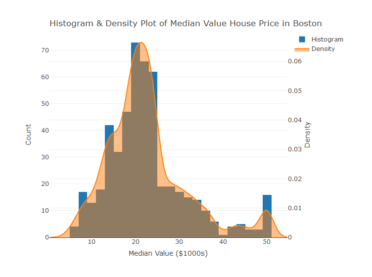<!-- -->

## Exercise 3

Explore and visualize any potential correlations between `medv` and the
variables `crim`, `rm`, `age`, `rad`, `tax` and `lstat`.

``` r
library(data.table)
library(ggplot2)
setDT(housing)

dt <- melt(data = housing[, .(crim, rm, age, rad, tax, lstat, medv)], id.vars = "medv")
head(dt)
```

    ##    medv variable   value
    ## 1: 24.0     crim 0.00632
    ## 2: 21.6     crim 0.02731
    ## 3: 34.7     crim 0.02729
    ## 4: 33.4     crim 0.03237
    ## 5: 36.2     crim 0.06905
    ## 6: 28.7     crim 0.02985

``` r
ggplot(data = dt, aes(x = value, y = medv, color = variable)) +
  geom_point() +
  stat_smooth(color = "black") +
  facet_wrap(.~variable, scales = "free") +
  labs(x = "Variable Value", y = "Median House Price ($1000s)", 
       title = "Correlations between medv and the variables") +
  theme_bw()
```

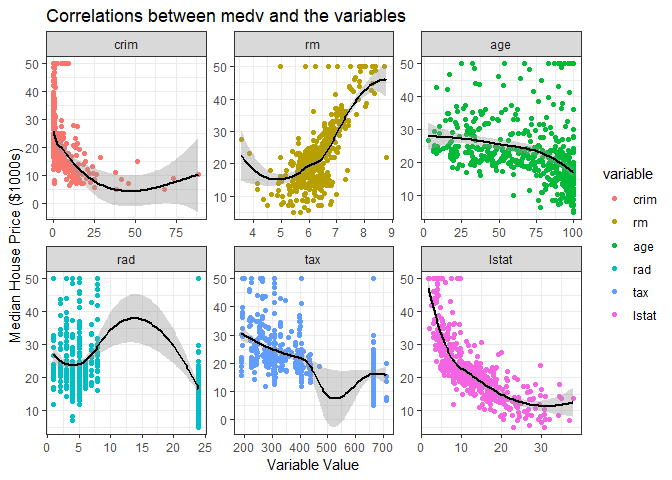<!-- -->

## Exercise 4

Set a seed of 123 and split your data into a train and test set using a
75/25 split. You may find the `caret` library helpful here.

``` r
library(caret)
set.seed(123)
to_train <- createDataPartition(y = housing$medv, p = 0.75, list = FALSE)
train <- housing[to_train, ]
test <- housing[-to_train, ]
```

## Exercise 5

We have seen that `crim`, `rm`, `tax`, and `lstat` could be good
predictors of `medv`. To get the ball rolling, let us fit a linear model
for these terms.

``` r
lm.model <- lm(formula = medv ~ crim + rm + tax + lstat,
               data = housing)
lm.model
```

    ## 
    ## Call:
    ## lm(formula = medv ~ crim + rm + tax + lstat, data = housing)
    ## 
    ## Coefficients:
    ## (Intercept)         crim           rm          tax        lstat  
    ##   -1.414928    -0.061579     5.248721    -0.005018    -0.534835

``` r
rs <- summary(lm.model)
rs
```

    ## 
    ## Call:
    ## lm(formula = medv ~ crim + rm + tax + lstat, data = housing)
    ## 
    ## Residuals:
    ##     Min      1Q  Median      3Q     Max 
    ## -16.383  -3.497  -1.149   1.825  30.716 
    ## 
    ## Coefficients:
    ##              Estimate Std. Error t value Pr(>|t|)    
    ## (Intercept) -1.414928   3.178364  -0.445   0.6564    
    ## crim        -0.061579   0.035562  -1.732   0.0840 .  
    ## rm           5.248721   0.439664  11.938   <2e-16 ***
    ## tax         -0.005018   0.001922  -2.611   0.0093 ** 
    ## lstat       -0.534835   0.050258 -10.642   <2e-16 ***
    ## ---
    ## Signif. codes:  0 '***' 0.001 '**' 0.01 '*' 0.05 '.' 0.1 ' ' 1
    ## 
    ## Residual standard error: 5.458 on 501 degrees of freedom
    ## Multiple R-squared:  0.6506, Adjusted R-squared:  0.6478 
    ## F-statistic: 233.2 on 4 and 501 DF,  p-value: < 2.2e-16

## Exercise 6

Obtain an r-squared value for your model and examine the diagnostic
plots found by plotting your linear
model.

``` r
rs$r.squared
```

    ## [1] 0.6506059

``` r
plot(lm.model)
```

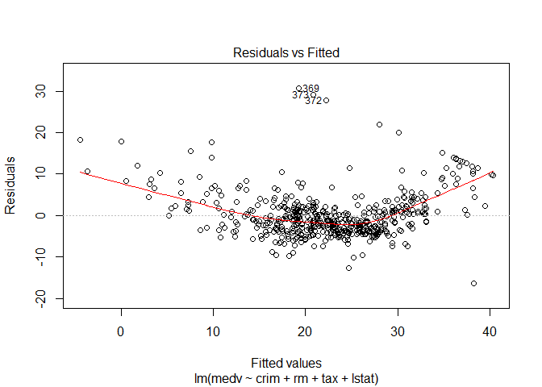<!-- -->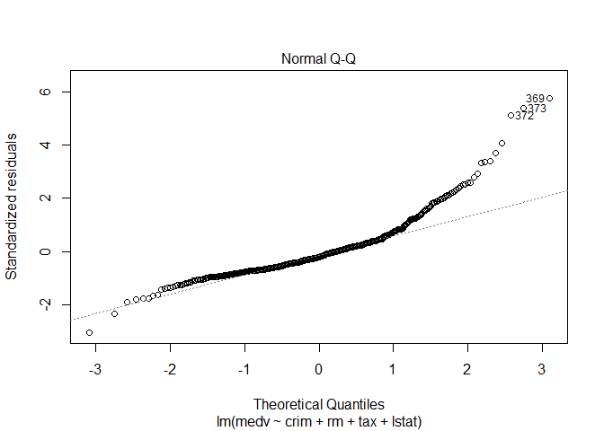<!-- -->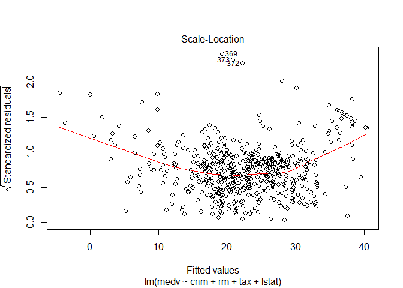<!-- -->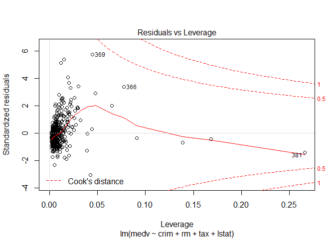<!-- -->

## Exercise 7

We can see a few problems with our model immediately with variables such
as 381 exhibiting a high leverage, a poor QQ plot in the tails a
relatively poor r-squared value. Let us try another model, this time
transforming MEDV due to the positive skewness it exhibited.

``` r
lm.log.model <- lm(log(medv) ~ crim + rm + tax + lstat, data = train)
lm.log.model
```

    ## 
    ## Call:
    ## lm(formula = log(medv) ~ crim + rm + tax + lstat, data = train)
    ## 
    ## Coefficients:
    ## (Intercept)         crim           rm          tax        lstat  
    ##   2.6567241   -0.0064501    0.1437772   -0.0003237   -0.0287214

``` r
summary(lm.log.model)
```

    ## 
    ## Call:
    ## lm(formula = log(medv) ~ crim + rm + tax + lstat, data = train)
    ## 
    ## Residuals:
    ##      Min       1Q   Median       3Q      Max 
    ## -0.70362 -0.12072 -0.01294  0.09350  0.91040 
    ## 
    ## Coefficients:
    ##               Estimate Std. Error t value Pr(>|t|)    
    ## (Intercept)  2.657e+00  1.468e-01  18.103  < 2e-16 ***
    ## crim        -6.450e-03  1.658e-03  -3.890 0.000119 ***
    ## rm           1.438e-01  2.024e-02   7.103 6.16e-12 ***
    ## tax         -3.237e-04  8.322e-05  -3.889 0.000119 ***
    ## lstat       -2.872e-02  2.295e-03 -12.516  < 2e-16 ***
    ## ---
    ## Signif. codes:  0 '***' 0.001 '**' 0.01 '*' 0.05 '.' 0.1 ' ' 1
    ## 
    ## Residual standard error: 0.2057 on 376 degrees of freedom
    ## Multiple R-squared:  0.7355, Adjusted R-squared:  0.7327 
    ## F-statistic: 261.4 on 4 and 376 DF,  p-value: < 2.2e-16

## Exercise 8

Examine the diagnostics for the model. What do you conclude? Is this an
improvement on the first model?  
One assumption of a linear model is that the mean of the residuals is
zero. You could try and test
this.

``` r
plot(lm.log.model)
```

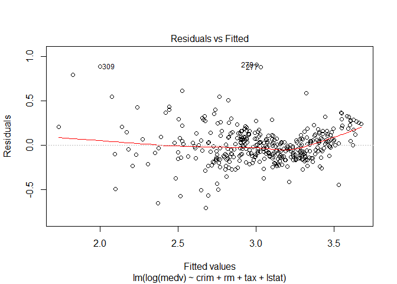<!-- -->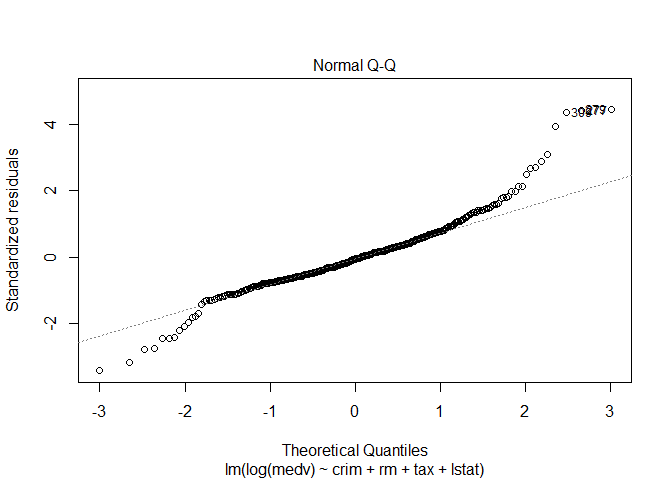<!-- -->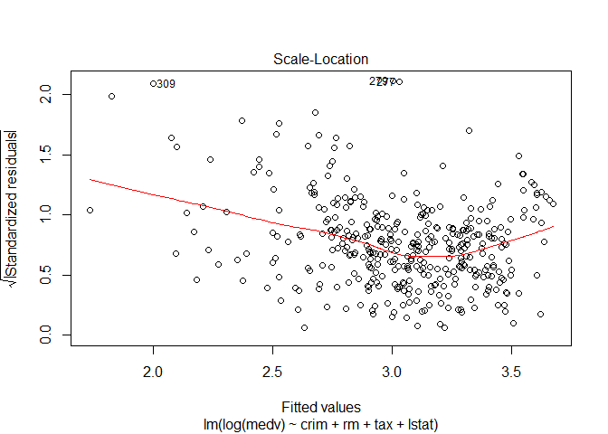<!-- -->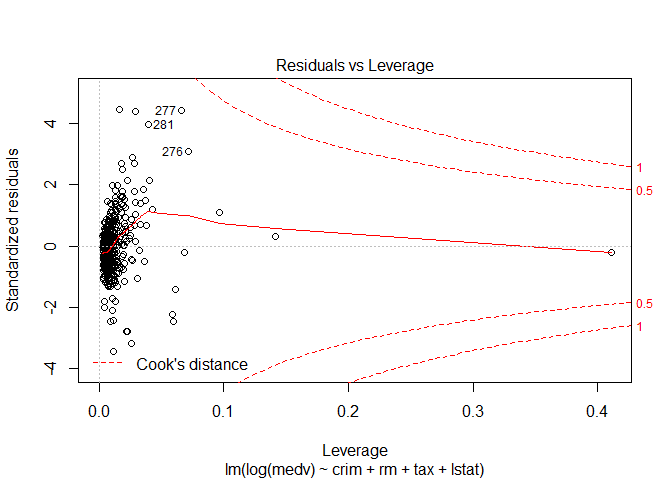<!-- -->

## Exercise 9

Create a data frame of your predicted values and the original
values.

``` r
result <- data.frame(original = test$medv, predict = exp(predict(lm.log.model, test)))
```

## Exercise 10

Plot this to visualize the performance of your model.

``` r
ggplot(data = result, aes(x = predict, y = original)) +
  geom_point() + 
  geom_smooth() +
  labs(x = "Predicted Values", y = "Original Values", 
       title = "Predicted vs. Original Values") +
  theme_bw()
```

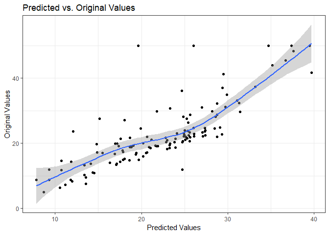<!-- -->
