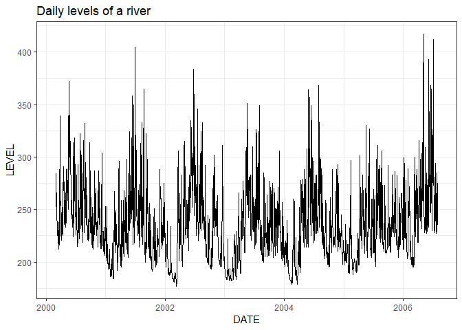
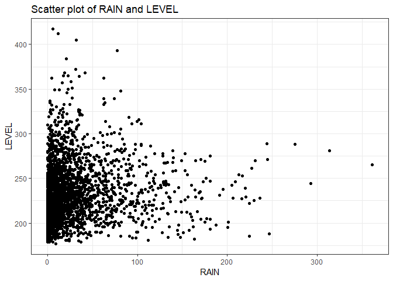
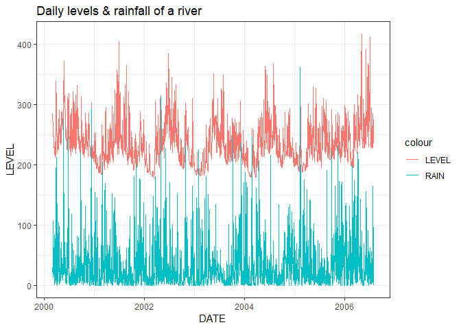
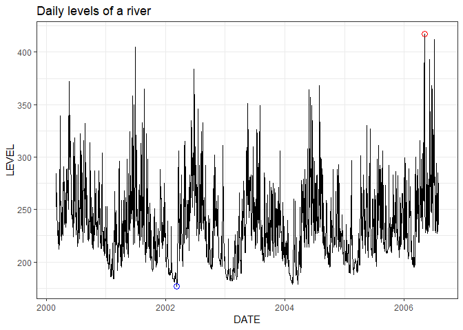
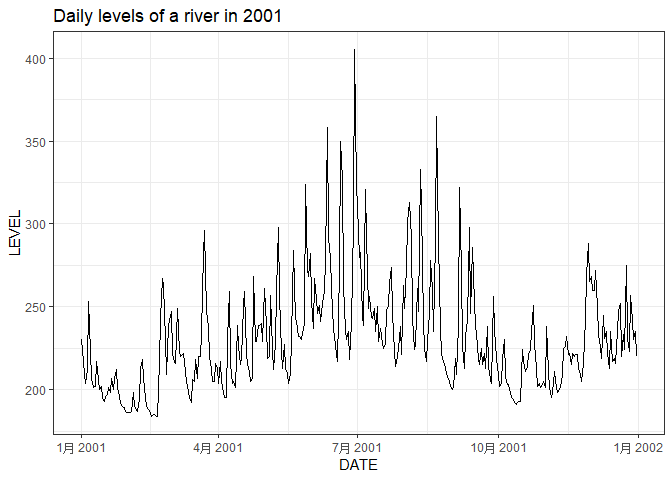

R For Hydrologists – Loading and Plotting Data Part 1: Exercises
================
Felipe Ardilac
27 February 2018


LOADING AND PLOTTING THE DATA (Part 1)

Working with hydro-meteorological data can be very time consuming and
exhausting. Luckily, R can provide a framework to easily import and
process data in order to implement statistical analysis and models. In
these tutorials, we are going to explore and analyze data from a
tropical basin in order to create a simple forecast model. Let’s have a
look at these exercises and examples.

Answers to these exercises are available
[here](http://r-exercises.com/2018/02/27/r-for-hydrologists-loading-and-plotting-the-data-part-1-solution/).

## Exercise 1

First, let’s import the daily levels of a river and the rainfall data
from the basin, stored in a CSV file. Please download the data
[here](https://www.r-exercises.com/wp-content/uploads/2018/03/PAICOL.csv)
(PAICOL.csv) and import it with the function `read.csv`.  
Then, assign it to `river_data`.

Remember that river\_data is a data frame, so we can access the
attributes of it with $; for example, you can get the date values with
`river_data$DATE`.

``` r
library(data.table)
river_data <- read.csv("https://www.r-exercises.com/wp-content/uploads/2018/03/PAICOL.csv")
setDT(river_data)
head(river_data)
```

    ##          DATE LEVEL  RAIN
    ## 1: 2000-03-01   284  19.9
    ## 2: 2000-03-02   261  39.5
    ## 3: 2000-03-03   253  61.9
    ## 4: 2000-03-04   266 106.3
    ## 5: 2000-03-05   264  13.3
    ## 6: 2000-03-06   247  18.2

## Exercise 2

To guarantee that the `DATE` column has the proper format, it is crucial
to convert the string values into dates with the function `as.Date`.
Please replace the value of DATE with formatted dates.

``` r
sapply(river_data, class)
```

    ##      DATE     LEVEL      RAIN 
    ##  "factor" "integer" "numeric"

``` r
river_data$DATE <- as.Date(river_data$DATE)
sapply(river_data, class)
```

    ##      DATE     LEVEL      RAIN 
    ##    "Date" "integer" "numeric"

## Exercise 3

Create a summary of the river\_data.

``` r
summary(river_data)
```

    ##       DATE                LEVEL            RAIN       
    ##  Min.   :2000-03-01   Min.   :177.0   Min.   :  0.00  
    ##  1st Qu.:2001-10-07   1st Qu.:210.0   1st Qu.:  5.20  
    ##  Median :2003-05-16   Median :230.0   Median : 17.20  
    ##  Mean   :2003-05-16   Mean   :235.3   Mean   : 31.72  
    ##  3rd Qu.:2004-12-22   3rd Qu.:255.0   3rd Qu.: 40.33  
    ##  Max.   :2006-07-31   Max.   :417.0   Max.   :361.50

## Exercise 4

Normally we can use the build in R functions; but, this time, we will
use the `ggplot` package. In my opinion, it is able to create better
plots. Before we start, install it and load it to be able to use it.

    install.packages("ggplot2")
    library(ggplot2)

Create a line plot of the `LEVEL` with the `ggplot` function.

``` r
library(ggplot2)
ggplot(data = river_data, aes(x = DATE, y = LEVEL)) +
  geom_line() +
  labs(title = "Daily levels of a river") +
  theme_bw()
```

<!-- -->

## Exercise 5

Create a scatter plot of the `RAIN` against `LEVEL`.

``` r
ggplot(data = river_data, aes(x = RAIN, y = LEVEL)) +
  geom_point() +
  labs(title = "Scatter plot of RAIN and LEVEL") +
  theme_bw()
```

<!-- -->

## Exercise 6

Create a plot of the `RAIN` and `LEVEL`.

``` r
ggplot(data = river_data, aes(x = DATE, y = LEVEL)) +
  geom_line(aes(color = "LEVEL")) +
  geom_line(aes(x = DATE, y = RAIN, color = "RAIN")) + 
  labs(title = "Daily levels & rainfall of a river") +
  theme_bw()
```

<!-- -->

## Exercise 7

Find and plot circles on the `LEVEL` plot at the maximum and minimum
value.

``` r
data_max <- river_data[which.max(river_data$LEVEL), ]
data_min <- river_data[which.min(river_data$LEVEL), ]

ggplot(data = river_data, aes(x = DATE, y = LEVEL)) +
  geom_line() +
  geom_point(aes(x = data_max$DATE, y = data_max$LEVEL), shape = 1, size = 3, color = "red") + 
  geom_point(aes(x = data_min$DATE, y = data_min$LEVEL), shape = 1, size = 3, color = "blue") + 
  scale_shape_discrete(solid = FALSE) +
  labs(title = "Daily levels of a river") +
  theme_bw()
```

<!-- -->

## Exercise 8

Plot the `LEVEL` for the year
“2001”.

``` r
ggplot(river_data[DATE %between% c("2001-01-01", "2001-12-31")], aes(x = DATE, y = LEVEL)) +
  geom_line() +
  labs(title = "Daily levels of a river in 2001") +
  theme_bw()
```

<!-- -->
