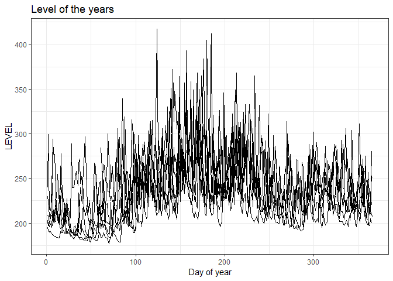
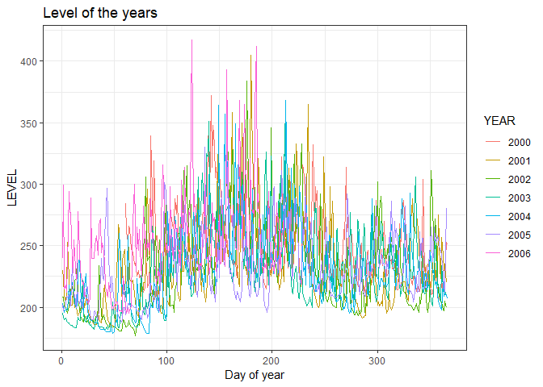
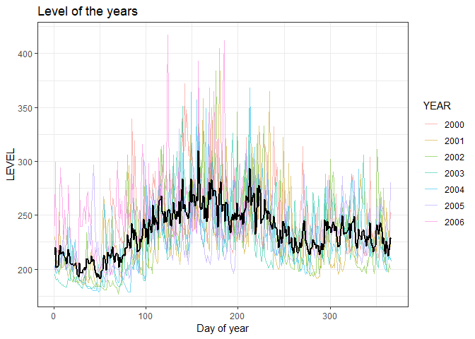
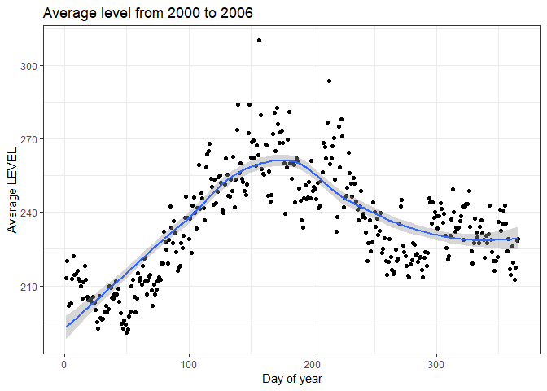
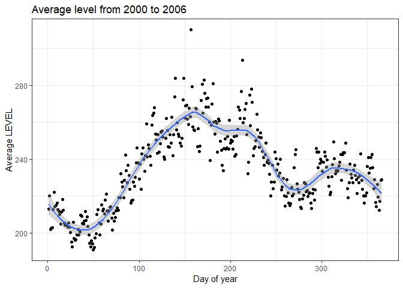

R For Hydrologists – Loading and Plotting Data Part 2: Exercises
================
Felipe Ardilac
6 March 2018


LOADING AND PLOTTING THE DATA (Part 2)

In hydrology, it is very common to analyze the annual behavior of the
levels in order to see if there is any recurrent patterns over the year
(seasonality.) In order to observe the historical behavior of the river,
we have to construct a plot with the level of all the years overlapped
from the first of January to the 31st of December. This task can be
solved in many possible ways, but this time we will use the capabilities
that `ggplot2` has to offer and organize information from the data
frames.

If you don’t have the data, please first see the first part of the
tutorial
[here](https://www.r-exercises.com/2018/02/27/r-for-hydrologists-loading-and-plotting-the-data-part-1/).

Answers to these exercises are available
[here](http://r-exercises.com/2018/03/06/r-for-hydrologists-loading-and-plotting-data-part-2-solution/).

## Exercise 1

First, we have to process a little bit of the data frame in order to
provide it to the `ggplot` function in the right format. Please add a
column `YEAR` and `DOY` (day of year) to the `river_data`.

Hint: the `lubridate` package has the function `yday` (year day) you can
install with the line.

    if(!require(lubridate)){install.packages(lubridate, dep=T)}

``` r
library(data.table)
river_data <- read.csv("https://www.r-exercises.com/wp-content/uploads/2018/03/PAICOL.csv")
setDT(river_data)
head(river_data)
```

    ##          DATE LEVEL  RAIN
    ## 1: 2000-03-01   284  19.9
    ## 2: 2000-03-02   261  39.5
    ## 3: 2000-03-03   253  61.9
    ## 4: 2000-03-04   266 106.3
    ## 5: 2000-03-05   264  13.3
    ## 6: 2000-03-06   247  18.2

``` r
library(lubridate)
river_data$DATE <- as.Date(river_data$DATE)
river_data$YEAR <- year(river_data$DATE)
river_data$DOY <- yday(river_data$DATE)
head(river_data)
```

    ##          DATE LEVEL  RAIN YEAR DOY
    ## 1: 2000-03-01   284  19.9 2000  61
    ## 2: 2000-03-02   261  39.5 2000  62
    ## 3: 2000-03-03   253  61.9 2000  63
    ## 4: 2000-03-04   266 106.3 2000  64
    ## 5: 2000-03-05   264  13.3 2000  65
    ## 6: 2000-03-06   247  18.2 2000  66

## Exercise 2

Create a plot with the level of all the years overlapped from the first
of January to the 31st of December with the `ggplot` function.

``` r
library(ggplot2)
ggplot(data = river_data, aes(x = DOY, y = LEVEL, group = YEAR)) +
  geom_line() +
  labs(x = "Day of year", title = "Level of the years") +
  theme_bw()
```

<!-- -->

## Exercise 3

Now it is plotted, but it doesn’t seem very clear because all the lines
have the same color. Please plot each line with a different color
according to the year.

``` r
river_data$YEAR <- factor(river_data$YEAR)
ggplot(data = river_data, aes(x = DOY, y = LEVEL, color = YEAR)) +
  geom_line() +
  labs(x = "Day of year", title = "Level of the years") +
  theme_bw()
```

<!-- -->

## Exercise 4

That looks better. Now we want to see the average annual behavior so we
will calculate the mean value of LEVEL for each `DOY` (day of the year)
using the function `aggregate`. Then assign it to the data frame
`mean_data`.

``` r
mean_data <- river_data[, .(DOY, LEVEL)][, mean(LEVEL), by = DOY][order(DOY)]
mean_data
```

    ##      DOY       V1
    ##   1:   1 213.0000
    ##   2:   2 220.0000
    ##   3:   3 201.8333
    ##   4:   4 202.5000
    ##   5:   5 203.0000
    ##  ---             
    ## 362: 362 219.3333
    ## 363: 363 212.3333
    ## 364: 364 217.3333
    ## 365: 365 228.5000
    ## 366: 366 229.0000

## Exercise 5

Please add a `DOY` column to the `mean_data`; also, a `YEAR` column with
the value `2000`. This last column has to be inserted in order to
overlap the plots with the function `ggplot`.

``` r
mean_data[, YEAR := 2000]
```

## Exercise 6

Please overlap the plot generated in Exercise 3 with the `mean_data`.

``` r
ggplot(data = river_data, aes(x = DOY, y = LEVEL, color = YEAR)) +
  geom_line(alpha = .5) +
  geom_line(data = mean_data, aes(x = DOY, y = V1), color = "black", size = 1) +
  labs(x = "Day of year", title = "Level of the years") +
  theme_bw()
```

<!-- -->

## Exercise 7

The mean looks a little bit spiky. In order to visualize better, we will
smooth the mean values with the function `qplot`.

``` r
qplot(data = mean_data, x = DOY, y = V1, 
      xlab = "Day of year",
      ylab = "Average LEVEL", 
      main = "Average level from 2000 to 2006") + 
  geom_smooth() +
  theme_bw()
```

<!-- -->

## Exercise 8

The default smoothing parameter flattens up too many details. Please
adjust the parameter `span` to get more details.

``` r
qplot(data = mean_data, x = DOY, y = V1, 
      xlab = "Day of year",
      ylab = "Average LEVEL", 
      main = "Average level from 2000 to 2006") + 
  geom_smooth(span = .3) +
  theme_bw()
```

<!-- -->
