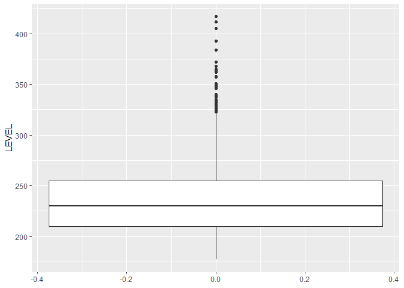
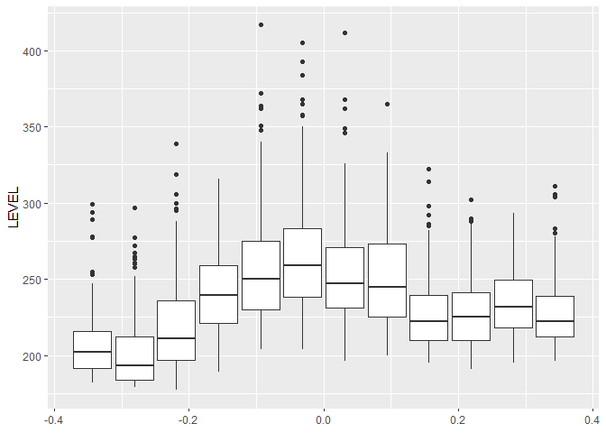
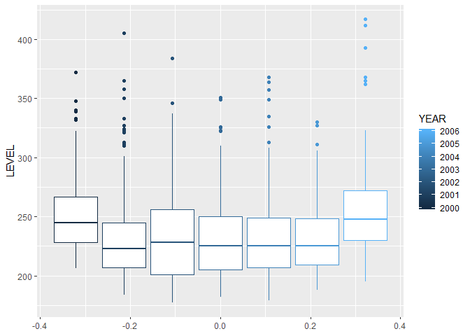
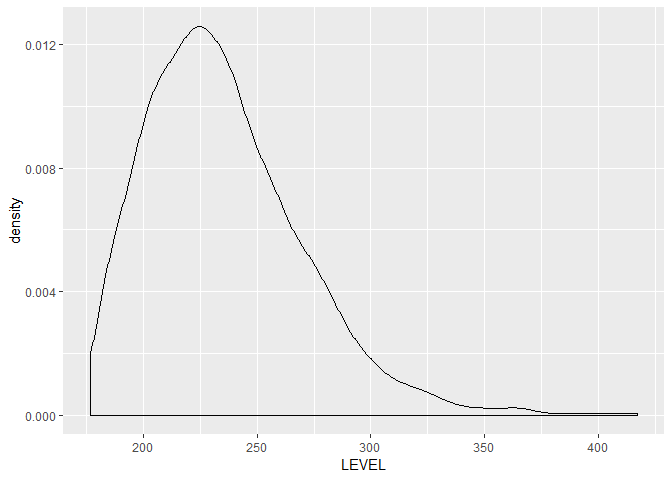
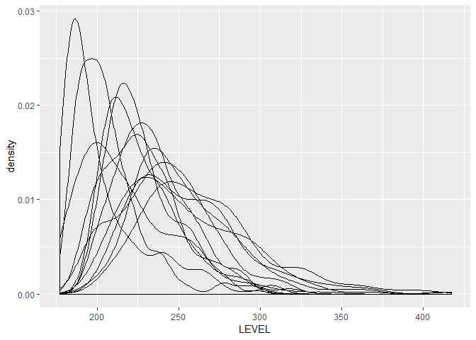
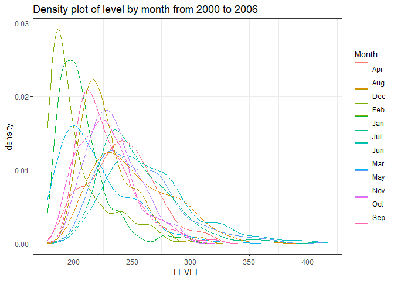

R For Hydrologists – Loading and Plotting Data Part 3: Exercises
================
Felipe Ardilac
13 March 2018


LOADING AND PLOTTING THE DATA (Part 3)

Creating a box plot of the data can be a good approach to inspect the
historical behavior of the river level and can show us how the data
spreads in different time indexing (Month/ Year). If you are not
familiar with this, a boxplot is a method for graphically depicting
groups of numerical data through their quartiles. The lower and upper
bounds of the box are first and third quartiles and the line inside the
box is the median. The wishers are one standard deviation above and
below the mean of the data. The outliers are plotted as individual
points.  
If you don’t have the data, please first see the first part of the
tutorial
[here](https://www.r-exercises.com/2018/02/27/r-for-hydrologists-loading-and-plotting-the-data-part-1/).

Answers to these exercises are available
[here](http://r-exercises.com/2018/03/13/r-for-hydrologists-loading-and-plotting-data-part-3-solution/).

## Exercise 1

Please create a box plot of the `LEVEL` with the `geom_boxplot`.

``` r
library(data.table)
river_data <- read.csv("https://www.r-exercises.com/wp-content/uploads/2018/03/PAICOL.csv")
setDT(river_data)
head(river_data)
```

    ##          DATE LEVEL  RAIN
    ## 1: 2000-03-01   284  19.9
    ## 2: 2000-03-02   261  39.5
    ## 3: 2000-03-03   253  61.9
    ## 4: 2000-03-04   266 106.3
    ## 5: 2000-03-05   264  13.3
    ## 6: 2000-03-06   247  18.2

``` r
library(lubridate)
river_data$DATE <- as.Date(river_data$DATE)
river_data$YEAR <- year(river_data$DATE)
river_data$MONTH <- month(river_data$DATE)
river_data$DOY <- yday(river_data$DATE)
head(river_data)
```

    ##          DATE LEVEL  RAIN YEAR MONTH DOY
    ## 1: 2000-03-01   284  19.9 2000     3  61
    ## 2: 2000-03-02   261  39.5 2000     3  62
    ## 3: 2000-03-03   253  61.9 2000     3  63
    ## 4: 2000-03-04   266 106.3 2000     3  64
    ## 5: 2000-03-05   264  13.3 2000     3  65
    ## 6: 2000-03-06   247  18.2 2000     3  66

``` r
library(ggplot2)
ggplot(data = river_data, aes(y = LEVEL)) + 
  geom_boxplot()
```

<!-- -->

## Exercise 2

Now please create a box plot for every `MONTH`.  
Hint: Use a `group` in the `aes` parameter.

``` r
ggplot(data = river_data, aes(y = LEVEL, group = MONTH)) + 
  geom_boxplot()
```

<!-- -->

## Exercise 3

Good, now please create a box plot for every `YEAR`. Please plot each
box with different color, according to the year.  
Hint: Use the `col` in the `aes` parameter.

``` r
ggplot(data = river_data, aes(y = LEVEL, group = YEAR, color = YEAR)) + 
  geom_boxplot()
```

<!-- -->

## Exercise 4

Another good way to see how data is distributed is through a histogram.
Please create a plot of a histogram of the `LEVEL` with the function
`geom_histogram`.

``` r
ggplot(data = river_data, aes(x = LEVEL)) + geom_histogram()
```

<!-- -->

## Exercise 5

As you see, the function tells us that it is using 30 bins for the
histogram, but that we can pick a better value with `binwidth`. Please
select a bandwidth according to the Freedman–Diaconis formula:  
binwidth = 2 \* IQR(river\_data$LEVEL) /
(length(river\_data$LEVEL)^(1/3))

``` r
ggplot(data = river_data, aes(x = LEVEL)) + 
  geom_histogram(binwidth = 2 * IQR(river_data$LEVEL) / (length(river_data$LEVEL)^(1/3)))
```

<!-- -->

## Exercise 6

Please use the `geom_density` to plot a kernel density estimate of the
`LEVEL`, which is a smoothed version of the histogram.

``` r
ggplot(data = river_data, aes(x = LEVEL)) + 
  geom_density()
```

<!-- -->

## Exercise 7

Now, please create a kernel density estimate for every month and overlap
it.

``` r
ggplot(river_data, aes(x = LEVEL,group = MONTH)) +  
  geom_density()
```

<!-- -->

## Exercise 8

The plot is very confusing because all curves have the same color.
Please assign a discrete set of colors for each month `span`.  
Hint: You can get the month string using `month.abb[MONTH]` inside the
`aes`.

``` r
ggplot(river_data, aes(x = LEVEL,group = MONTH, color = month.abb[MONTH])) +  
  geom_density() +
  scale_color_discrete(name = "Month") +
  labs(title = "Density plot of level by month from 2000 to 2006") +
  theme_bw()
```

<!-- -->
