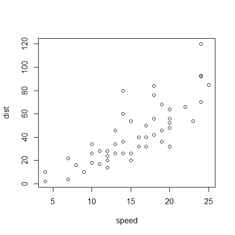
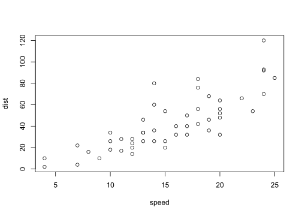

R Markdown exercises part 1
================
Euthymios Kasvikis
29 July 2017


## INTRODUCTION

R Markdown is one of the most popular data science tools and is used to
save and execute code, create exceptional reports whice are easily
shareable.

The documents that R Markdown provides are fully reproducible and
support a wide variety of static and dynamic output formats.

Using markdown syntax, which provides an easy way of creating documents
that can be converted to many other file types, while embeding R code in
the report, so it is not necessary to keep the report and R script
separately. Furthermore The report is written as normal text, so
knowledge of HTML is not required. Of course no additional files are
needed because everything is incorporated in the HTML file.

Before proceeding, please follow our short
[tutorial](http://r-exercises.com/2017/07/21/how-to-create-reports-with-r-markdown-in-rstudio/).

Look at the examples given and try to understand the logic behind them.
Then try to solve the exercises below using R and without looking at the
answers. Then check the
[solutions](http://r-exercises.com/2017/07/29/r-markdown-exercises-solutions/).
to check your answers.

## Exercise 1

Create a new R Markdown file (.Rmd) in RStudio.

    ## [1] "File -> New File -> R Markdown..."

## Exercise 2

Insert a YAML Header with title, author and date of your choice at the
top of your `.Rmd` script.

    ---
    title: 'R Markdown exercises part 1'
    author: "Euthymios Kasvikis"
    date: "29 July 2017"
    output: rmarkdown::github_document
    ---

## Exercise 3

Display the summary of “cars” dataset in your report. **HINT**: Use
`summary()`.

``` r
summary(cars)
```

    ##      speed           dist       
    ##  Min.   : 4.0   Min.   :  2.00  
    ##  1st Qu.:12.0   1st Qu.: 26.00  
    ##  Median :15.0   Median : 36.00  
    ##  Mean   :15.4   Mean   : 42.98  
    ##  3rd Qu.:19.0   3rd Qu.: 56.00  
    ##  Max.   :25.0   Max.   :120.00

## Exercise 4

Make a plot of the “cars” dataset under the summary you just created.
**HINT**: Use
`plot()`.

``` r
plot(cars)
```

<!-- -->

## Exercise 5

Create a small experimental dataframe and dipslay it in your report.
**HINT**: Use `data.frame()`.

``` r
head(data.frame(cars))
```

    ##   speed dist
    ## 1     4    2
    ## 2     4   10
    ## 3     7    4
    ## 4     7   22
    ## 5     8   16
    ## 6     9   10

## Exercise 6

Hide the code from your report. **HINT**: Use `echo`.

## Exercise 7

Load the package `knitr` in your `.Rmd` file. and hide the code chunk.
**HINT**: Use `echo`.

## Exercise 8

Hide the warning message that appeared in your report. **HINT**: Use
`warning`.

``` r
"warning=FALSE"
```

    ## [1] "warning=FALSE"

## Exercise 9

Set `fig.width` and `fig.height` of your plot to
5.

``` r
plot(cars)
```

<!-- -->

## Exercise 10

Change the file format of your plot from `.png` to `.svg`. **HINT**: Use
`dev`.

``` r
plot(cars)
```

<!-- -->
