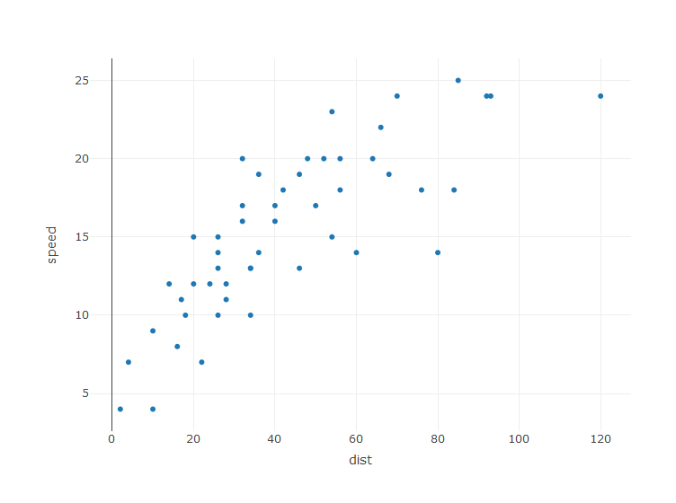
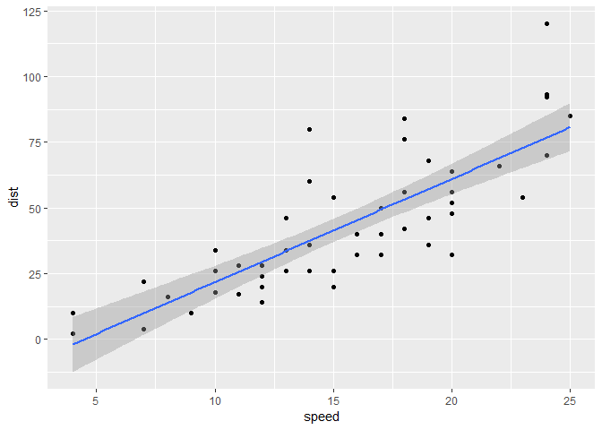
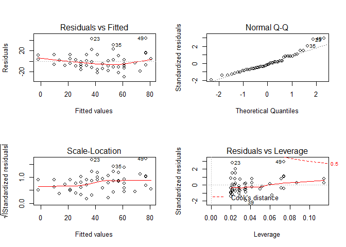
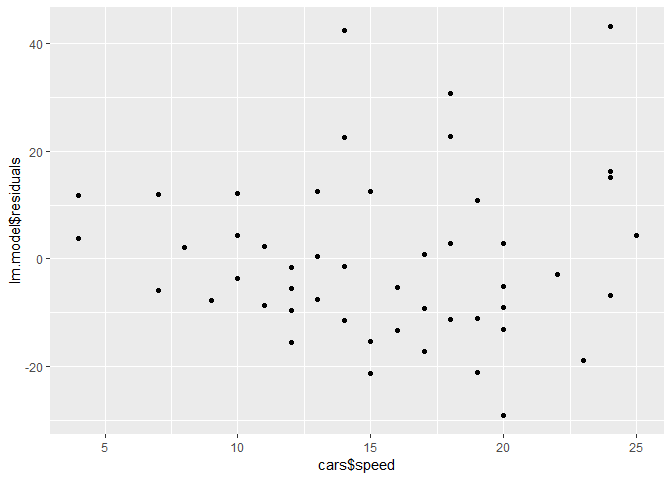

Regression Model Assumptions Exercises
================
Easton White
14 October 2017


You might fit a statistical model to a set of data and obtain parameter
estimates. However, you are not done at this point. You need to make
sure the assumptions of the particular model you used were met.

One tool is to examine the model residuals. We previously discussed this
in a
[tutorial](https://www.r-exercises.com/2017/09/30/regression-model-assumptions-tutorial/).
The residuals are the difference between your observed data and your
predicted values. In this exercise set, you will examine several aspects
of residual plots. These residual plots help determine if you have met
your model assumptions.

Answers to the exercises are available [here]().

## Exercise 1

Load the `cars` data set using the `data()` function. This data contains
the stopping distances (feet) for different car speeds (miles per hour).
The data was recorded in the 1920s.

``` r
library(data.table)
cars <- datasets::cars
setDT(cars)
head(cars)
```

    ##    speed dist
    ## 1:     4    2
    ## 2:     4   10
    ## 3:     7    4
    ## 4:     7   22
    ## 5:     8   16
    ## 6:     9   10

## Exercise 2

Plot car speeds on the y-axis and stopping distances on the x-axis. What
kind of pattern is present?

``` r
library(plotly)
plot_ly(data = cars, x =~ dist, y =~ speed, type = "scatter")
```

<!-- -->

> There is a correlation between stopping distance and speed. Stopping
> distances increases as speed increases.

## Exercise 3

Using the `lm()` function to fit a linear model to the data with the
stopping distance as the response variable. Plot the line of best fit.

``` r
library(ggplot2)
ggplot(data = cars, aes(x = speed, y = dist)) + 
  geom_point() +
  geom_smooth(method = "lm")
```

<!-- -->

## Exercise 4

Use `summary()` to obtain parameter estimates and model details. Is the
slope significantly different than zero? How much of the variance can be
explained by car speed?

``` r
lm.model <- lm(formula = dist ~ speed, data = cars)
summary(lm.model)
```

    ## 
    ## Call:
    ## lm(formula = dist ~ speed, data = cars)
    ## 
    ## Residuals:
    ##     Min      1Q  Median      3Q     Max 
    ## -29.069  -9.525  -2.272   9.215  43.201 
    ## 
    ## Coefficients:
    ##             Estimate Std. Error t value Pr(>|t|)    
    ## (Intercept) -17.5791     6.7584  -2.601   0.0123 *  
    ## speed         3.9324     0.4155   9.464 1.49e-12 ***
    ## ---
    ## Signif. codes:  0 '***' 0.001 '**' 0.01 '*' 0.05 '.' 0.1 ' ' 1
    ## 
    ## Residual standard error: 15.38 on 48 degrees of freedom
    ## Multiple R-squared:  0.6511, Adjusted R-squared:  0.6438 
    ## F-statistic: 89.57 on 1 and 48 DF,  p-value: 1.49e-12

> There estimated slope coefficient is significantly different than
> zero. The R-squared values indicate that about 65% of the variance in
> stopping distance can be explained by speed.

## Exercise 5

Use the `plot()` command on the linear model to obtain the four plots of
residuals.

``` r
par(mfrow = c(2,2))
plot(lm.model)
```

<!-- -->

## Exercise 6

Are the data homoscedastic? Homoscedastic data means the distribution of
errors should be the same for all values of the explanatory variable.

> Yes, the data does appear to be homoscedastic. The mean for the errors
> is the same for all values of the explanatory variable. This can be
> seen in the top-left or bottom-left plots of the four-panel figure in
> exercise 5. A perfectly horizontal line at 0 would indicate the mean
> of the residuals is zero and the same for all values of the
> explanatory variable. We see there is some deviance from a horizontal
> line at the tails of the explanatory variable.

## Exercise 7

Are the residuals normally-distributed?

> The QQ plot (top-right of the four-panel figure) indicates that the
> residuals are close to normally-distributed. There is some deviance
> from normality at the tails of the distribution where there are fewer
> data points.

## Exercise 8

Are the residuals correlated with the explanatory
variable?

``` r
qplot(x = cars$speed, y = lm.model$residuals)
```

<!-- -->

> The residuals are not correlated with the explanatory variable.

## Exercise 9

Bonus test. Now take a look at the fourth plot: the residuals versus
leverage. This plot does not indicate whether we have met model
assumptions, but it does tell us if certain data points are more
influential than others in the regression. Points that have been labeled
with a number have a high [Cook’s
Distance](https://en.wikipedia.org/wiki/Cook%27s_distance), which means
they are particularly influential for the regression. These are usually
the points not clustered with the majority of points. Are there any
points with a high Cook’s distance?

> There are several points (on the bottom-right plot of the four-panel
> figure) with a large Cook’s distance that may have an influence on the
> regression, including points labeled 49, 23, and 39.

## Exercise 10

Remove the 49th record (the one with a large Cook’s distance) from the
data. How does this change the parameter estimates in the model
regression?

``` r
cars_ <- cars[cars[, .I != 49, ]]
lm.model_ <- lm(formula = dist ~ speed, data = cars_)
summary(lm.model_)
```

    ## 
    ## Call:
    ## lm(formula = dist ~ speed, data = cars_)
    ## 
    ## Residuals:
    ##     Min      1Q  Median      3Q     Max 
    ## -26.789  -9.149  -1.672   8.013  43.048 
    ## 
    ## Coefficients:
    ##             Estimate Std. Error t value Pr(>|t|)    
    ## (Intercept) -14.0021     6.2951  -2.224    0.031 *  
    ## speed         3.6396     0.3918   9.290 3.26e-12 ***
    ## ---
    ## Signif. codes:  0 '***' 0.001 '**' 0.01 '*' 0.05 '.' 0.1 ' ' 1
    ## 
    ## Residual standard error: 14.1 on 47 degrees of freedom
    ## Multiple R-squared:  0.6474, Adjusted R-squared:  0.6399 
    ## F-statistic: 86.31 on 1 and 47 DF,  p-value: 3.262e-12

> We see that removing the 49th record changed some values in the model
> regression, but nothing to qualitatively alter the results. For
> example, the estimated slope coefficient is now slightly smaller.
