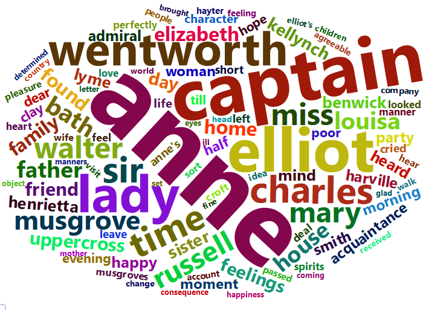

Tidy Text Mining Exercises
================
Jakub Kwiecien
12 November 2017


Text mining can be messy. Tokenization, document-term matrices,
lexicons… Lots of data structures and transformations between them.
Fortunately, there is the `tidytext` package, which will help you to
tidy this mess\!

Answers to the exercises are available
[here](http://r-exercises.com/2017/11/12/tidy-text-mining-solutions/).

If you obtained a different (correct) answer than those listed on the
solutions page, please feel free to post your answer as a comment on
that page.

## Exercise 1

Load `tidytext`, `janeaustenr`, `stringr` and `dplyr` packages. Load
Jane Austen\`s books and examine how the data looks.

``` r
library(tidytext)
library(janeaustenr)
library(stringr)
library(dplyr)

books <- austen_books()
head(books)
```

    ## # A tibble: 6 x 2
    ##   text                  book               
    ##   <chr>                 <fct>              
    ## 1 SENSE AND SENSIBILITY Sense & Sensibility
    ## 2 ""                    Sense & Sensibility
    ## 3 by Jane Austen        Sense & Sensibility
    ## 4 ""                    Sense & Sensibility
    ## 5 (1811)                Sense & Sensibility
    ## 6 ""                    Sense & Sensibility

``` r
summary(books)
```

    ##      text                            book      
    ##  Length:73422       Sense & Sensibility:12624  
    ##  Class :character   Pride & Prejudice  :13030  
    ##  Mode  :character   Mansfield Park     :15349  
    ##                     Emma               :16235  
    ##                     Northanger Abbey   : 7856  
    ##                     Persuasion         : 8328

## Exercise 2

Add a column identifying the line in a book. Split text into words.

``` r
books_tokenized <- books %>%
  group_by(book) %>%
  mutate(line = row_number()) %>%
  unnest_tokens(word, text, token = 'words')
head(books_tokenized)
```

    ## # A tibble: 6 x 3
    ## # Groups:   book [1]
    ##   book                 line word       
    ##   <fct>               <int> <chr>      
    ## 1 Sense & Sensibility     1 sense      
    ## 2 Sense & Sensibility     1 and        
    ## 3 Sense & Sensibility     1 sensibility
    ## 4 Sense & Sensibility     3 by         
    ## 5 Sense & Sensibility     3 jane       
    ## 6 Sense & Sensibility     3 austen

## Exercise 3

Remove stopwords.

``` r
length(unique(books_tokenized$word))
```

    ## [1] 14520

``` r
head(stop_words)
```

    ## # A tibble: 6 x 2
    ##   word      lexicon
    ##   <chr>     <chr>  
    ## 1 a         SMART  
    ## 2 a's       SMART  
    ## 3 able      SMART  
    ## 4 about     SMART  
    ## 5 above     SMART  
    ## 6 according SMART

``` r
nrow(stop_words)
```

    ## [1] 1149

``` r
books_tidy <- books_tokenized %>%
  anti_join(stop_words)
```

    ## Joining, by = "word"

``` r
head(books_tidy)
```

    ## # A tibble: 6 x 3
    ## # Groups:   book [1]
    ##   book                 line word       
    ##   <fct>               <int> <chr>      
    ## 1 Sense & Sensibility     1 sense      
    ## 2 Sense & Sensibility     1 sensibility
    ## 3 Sense & Sensibility     3 jane       
    ## 4 Sense & Sensibility     3 austen     
    ## 5 Sense & Sensibility     5 1811       
    ## 6 Sense & Sensibility    10 chapter

``` r
length(unique(books_tidy$word))
```

    ## [1] 13914

## Exercise 4

Create a wordcloud of 100 most frequent words. Hint: Use `wordcloud`
package.

``` r
library(wordcloud2)
library(htmlwidgets)

word_freq <- books_tidy %>%
  count(word)

book <- unique(word_freq$book)

for(i in book) {
  dataset <- word_freq %>% 
    filter(book == i) %>% 
    arrange(desc(n)) %>%
    head(100)
  
  wc <- wordcloud2(data.frame(word = dataset$word, freq = dataset$n))

  saveWidget(wc, paste0(i, ".html"), selfcontained = F)
  output_path <- paste0("Tidy_Text_Mining_Exercises_files/figure-gfm/", i, ".png")
  webshot::webshot(paste0(i, ".html"), 
                   output_path,
                   vwidth = 700, 
                   vheight = 500, 
                   delay = 7)
  cat(paste0("- ", i, "\n"))
  cat("  ")
  cat(paste0('\n'))
  if (file.exists(paste0(i, ".html"))) file.remove(paste0(i, ".html"))
  unlink(paste0(i, "_files"), recursive = TRUE, force = TRUE)
}
```

  - Sense & Sensibility
    
  - Pride & Prejudice
    
  - Mansfield Park
    
  - Emma 
  - Northanger Abbey
    
  - Persuasion
    

## Exercise 5

Find the most frequent words for each book.

``` r
word_freq %>% 
  group_by(book) %>% 
  arrange(desc(n)) %>% 
  filter(row_number() == 1)
```

    ## # A tibble: 6 x 3
    ## # Groups:   book [6]
    ##   book                word          n
    ##   <fct>               <chr>     <int>
    ## 1 Mansfield Park      fanny       816
    ## 2 Emma                emma        786
    ## 3 Sense & Sensibility elinor      623
    ## 4 Pride & Prejudice   elizabeth   597
    ## 5 Persuasion          anne        447
    ## 6 Northanger Abbey    catherine   428

## Exercise 6

Perform TF-IDF transformation of the books. Find the words with the
highest TF-IDF score for each book.

``` r
word_freq %>%
  group_by(book) %>%
  mutate(tf = n / sum(n)) %>%
  arrange(desc(n)) %>%
  bind_tf_idf(term = word, document = book, n = n) %>%
  arrange(desc(tf_idf)) %>%
  filter(row_number() == 1)
```

    ## # A tibble: 6 x 6
    ## # Groups:   book [6]
    ##   book                word         n      tf   idf tf_idf
    ##   <fct>               <chr>    <int>   <dbl> <dbl>  <dbl>
    ## 1 Sense & Sensibility elinor     623 0.0171   1.79 0.0307
    ## 2 Emma                emma       786 0.0168   1.10 0.0185
    ## 3 Mansfield Park      crawford   493 0.0103   1.79 0.0184
    ## 4 Pride & Prejudice   darcy      373 0.0100   1.79 0.0179
    ## 5 Persuasion          elliot     254 0.00997  1.79 0.0179
    ## 6 Northanger Abbey    tilney     196 0.00823  1.79 0.0148

## Exercise 7

Create a document-term matrix.

``` r
books_tidy %>%
  count(word) %>%
  cast_dtm(book, word, n)
```

    ## <<DocumentTermMatrix (documents: 6, terms: 13914)>>
    ## Non-/sparse entries: 37224/46260
    ## Sparsity           : 55%
    ## Maximal term length: 19
    ## Weighting          : term frequency (tf)

## Exercise 8

Use Bing sentiment lexicon and calculate the overall sentiment of each
book.

``` r
sentiment_bing <- get_sentiments('bing')
head(sentiment_bing)
```

    ## # A tibble: 6 x 2
    ##   word       sentiment
    ##   <chr>      <chr>    
    ## 1 2-faced    negative 
    ## 2 2-faces    negative 
    ## 3 a+         positive 
    ## 4 abnormal   negative 
    ## 5 abolish    negative 
    ## 6 abominable negative

``` r
books_tidy %>%
  inner_join(sentiment_bing) %>%
  mutate(sentiment = 2*(sentiment == 'positive') - 1) %>%
  group_by(book) %>%
  summarise(sentiment = mean(sentiment))
```

    ## Joining, by = "word"

    ## # A tibble: 6 x 2
    ##   book                sentiment
    ##   <fct>                   <dbl>
    ## 1 Sense & Sensibility   0.0304 
    ## 2 Pride & Prejudice     0.0398 
    ## 3 Mansfield Park        0.0105 
    ## 4 Emma                  0.0417 
    ## 5 Northanger Abbey     -0.00893
    ## 6 Persuasion            0.0710

## Exercise 9

Use NRC sentiment lexicon and calculate how the emotions vary over time
in each book. Display results with a plot.

``` r
library(ggplot2)
sentiment_nrc <- get_sentiments('nrc')
books_tidy %>%
  group_by(book) %>%
  mutate(index = line %/% 500) %>%
  inner_join(sentiment_nrc) %>%
  group_by(book, index, sentiment) %>%
  summarise(n = n()) %>%
  ggplot(aes(index, n, color = sentiment)) +
  geom_line() +
  facet_wrap(~book, ncol = 2, scales = "free_x") +
  theme_bw()
```

    ## Joining, by = "word"

<!-- -->

## Exercise 10

Count the sentences in each book.

``` r
books %>%
  group_by(book) %>%
  unnest_tokens(sentence, text, token = 'sentences') %>%
  group_by(book) %>%
  summarise(n = n())
```

    ## # A tibble: 6 x 2
    ##   book                    n
    ##   <fct>               <int>
    ## 1 Sense & Sensibility  5485
    ## 2 Pride & Prejudice    7066
    ## 3 Mansfield Park       7804
    ## 4 Emma                 9128
    ## 5 Northanger Abbey     3920
    ## 6 Persuasion           3652
