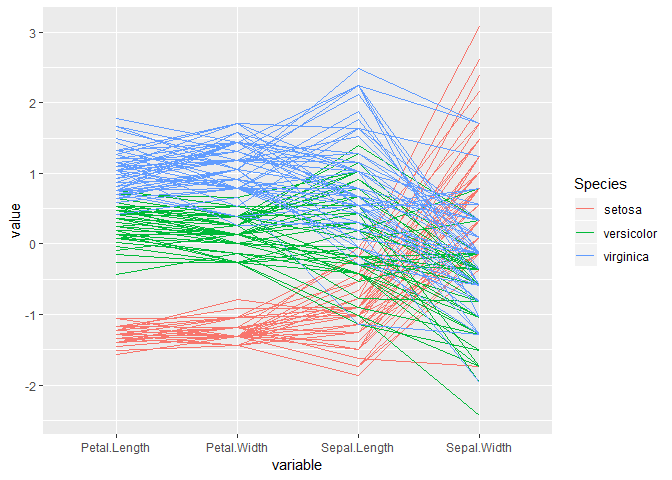
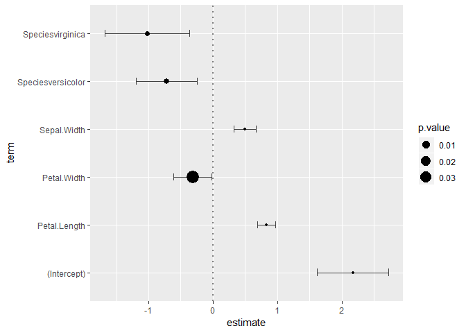

Visual Data Exploration Exercises
================
Jakub Kwiecien
15 October 2017


The first thing you should do when you start working with new data is to
explore it to learn what’s in there. The easiest way to do this is by
visualization. Distributions, point plots, etc. They are very helpful,
but plotting all of them for each variable or pair of variables can be
time-consuming. That’s where GGally comes in handy. It extends,ggplot2
adding a few very useful functions for plotting multiple plots at once.

Answers to the exercises are available
[here](http://r-exercises.com/2017/10/15/visual-data-exploration-solutions/).

If you obtained a different (correct) answer than those listed on the
solutions page, please feel free to post your answer as a comment on
that page. 　

## Exercise 1

Load `ggplot2` and `GGally` packages. Use `ggpairs` functions to explore
the `iris` dataset.

``` r
library(ggplot2)
library(GGally)
ggpairs(iris)
```

<!-- -->

## Exercise 2

Customize the plot by setting different colors for each species of iris
and adjusting `alpha` to make the plot more
readable.

``` r
ggpairs(iris, aes(color = Species, alpha = .5))
```

<!-- -->

## Exercise 3

Change the plot to apply the colors and `alpha` from exercise 2, only to
lower the triangle of the plot.

``` r
ggpairs(iris, 
        lower = list(mapping = aes(color = Species, alpha = .5)))
```

<!-- -->

## Exercise 4

Put variables names on the diagonal of the plot.

``` r
ggpairs(iris,
        lower = list(mapping = aes(color = Species, alpha = .5)),
        axisLabels = 'internal')
```

<!-- -->

## Exercise 5

Create custom plotting function that utilizes `geom_quasirandom`
function from `ggbeeswarm` package and uses it for pairs with
categorical X and continuous Y in the upper triangle of the plot.

``` r
library(ggbeeswarm)
my_beeswarm <- function(data, mapping, ...) {
  ggplot(data = data, mapping = mapping) +
    ggbeeswarm::geom_quasirandom(...)
}
ggpairs(iris,
        lower = list(mapping = aes(color = Species, alpha = .6)),
        upper = list(combo = my_beeswarm),
        axisLabels = 'internal')
```

<!-- -->

## Exercise 6

Use `ggscatmat` function in iris. Colour it by species. What are the
differences with
    `ggpairs`?

``` r
ggscatmat(iris, color = 'Species')
```

    ## Warning in ggscatmat(iris, color = "Species"): Factor variables are omitted
    ## in plot

<!-- -->
\> ggscatmat is faster than ggpairs, but it handles continous variables
only.

## Exercise 7

Plot parallel coordinate plots of continuous columns in `iris`. Color it
by
species.

``` r
ggparcoord(data = iris, columns = 1:4, groupColumn = 5, order = 'allClass')
```

<!-- -->

## Exercise 8

Fit linear model of `Sepal.Length` against all other columns. Using
`GGally`, display coefficients of the fit.

``` r
model <- lm(Sepal.Length ~ ., data = iris)
ggcoef(model)
```

<!-- -->

## Exercise 9

Modify the plot from exercise 8 by adding vertical endings to error bars
and making size of the points depend on
p-value.

``` r
ggcoef(model, errorbar_height = .15, aes(x = estimate, y = term, size = p.value))
```

<!-- -->

## Exercise 10

Plot all available model diagnostics with
ggnostic.

``` r
ggnostic(model, columnsY = c(".resid", ".sigma", ".hat", ".cooksd", ".fitted", ".se.fit", ".std.resid"))
```

<!-- -->
